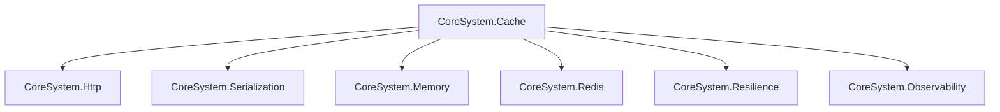

# Dependency Injection

## Introduction

Explain how CoreSystem integrates with the .NET dependency injection container.

---

## Registration Pattern

Describe the standard registration pattern used by all CoreSystem packages.

Example:

- AddCoreCache()
- AddCoreResilience()
- AddCoreHttp()
- AddCoreIdempotency()
- AddCoreMemory()
- AddCoreRedis()

---

## Configuration Pattern

Explain how each package uses the Options pattern.

Example:

builder.Services.AddCoreCache(options =>
{
    ...
});

---

## Service Lifetimes

Describe when CoreSystem uses:

- Singleton
- Scoped
- Transient

and the reasoning behind each choice.

---

## Extension Methods

Explain why every package exposes extension methods for IServiceCollection.

---

## Package Dependencies

Describe how packages depend on each other.

---

## Best Practices

- Register packages once.
- Configure through Options.
- Avoid manual registrations.
- Prefer the provided extension methods.

---

## Common Errors

- Missing service registrations
- Invalid options
- Duplicate registrations
- Missing provider packages