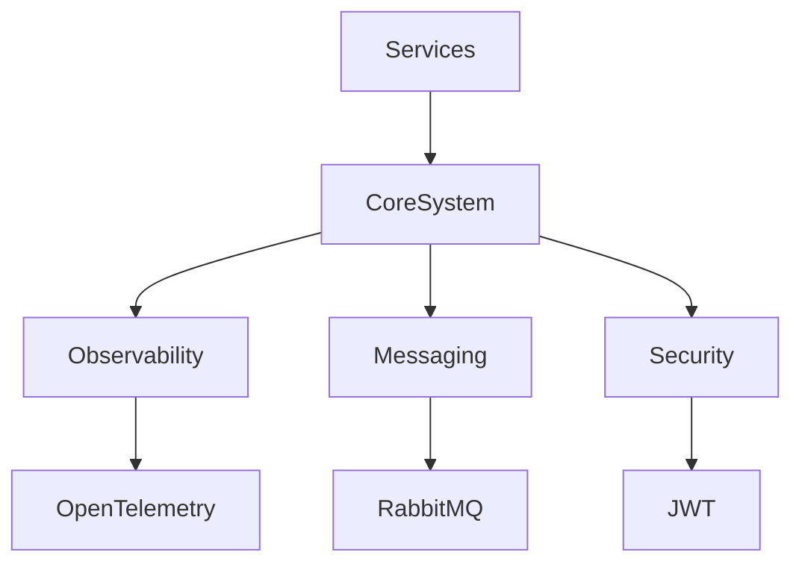

# ⚙️ CoreSystem Ecosystem

<p align="center">
  
  
  
  
  
</p>

<p align="center">
  <b>Cloud-Native • Modular • Observability-First • Enterprise-Ready</b>
</p>

---

## 📖 Overview

**CoreSystem** is a centralized ecosystem of reusable .NET libraries designed to standardize and accelerate the development of modern distributed systems and high-performance microservices.

The project focuses on:

- Consistent architecture across services
- Shared infrastructure components
- Cloud-native engineering practices
- Developer productivity
- Production-ready integrations

---

## ✨ Core Features

| Category | Description |
|----------|-------------|
| 🏗 Architecture | Modular reusable libraries |
| 📊 Observability | OpenTelemetry + Metrics + Logging |
| 📨 Messaging | RabbitMQ / Azure Service Bus abstractions |
| 🛡 Security | Shared JWT validation & authorization |
| ⚡ Performance | Optimized for scalable microservices |
| 🐳 Dev Experience | Docker-first workflows |

---

## 🧠 Architecture



---

## 📦 Planned Modules

| Module | Description | Status |
|---|---|---|
| `Core.Observability` | OpenTelemetry, Prometheus, Jaeger, Serilog integration | 🚧 Upcoming |
| `Core.Messaging` | RabbitMQ / Azure Service Bus abstractions | 📋 Planned |
| `Core.Security` | JWT validation and authorization policies | 📋 Planned |

---

## 🏗 Repository Structure

```text
CoreSystem/
│
├── src/                     # Production-ready libraries
│   ├── Core.Observability/
│   ├── Core.Messaging/
│   └── Core.Security/
│
├── samples/                 # Example implementations
│   ├── Sample.Api/
│   └── Sample.Worker/
│
├── tests/                   # Unit & integration tests
│
├── docs/                    # Architecture & guides
│
├── docker/
│
├── CoreSystem.sln
└── README.md
```

---

## 🏗 Tech Stack

- .NET 8
- ASP.NET Core
- OpenTelemetry
- Serilog
- RabbitMQ
- Docker & Docker Compose
- Kubernetes
- xUnit

---

## 🚀 Getting Started

### 🐳 Run with Docker

```bash
docker compose up -d --build
```

---

### 💻 Build Solution

```bash
dotnet build
```

---

### ▶️ Run Sample API

```bash
cd samples/Sample.Api
dotnet run
```

---

## 📊 Observability Vision

CoreSystem aims to provide production-grade observability out of the box:

- 🔭 Distributed tracing → OpenTelemetry
- 📈 Metrics → Prometheus
- 📊 Dashboards → Grafana
- 🧾 Structured logging → Serilog
- 🩺 Health checks integration

---

## 🧪 Engineering Goals

This ecosystem is designed to demonstrate:

- Enterprise-level architecture
- Reusable platform engineering
- Scalable distributed systems
- Clean and maintainable codebases
- Cloud-native backend development

---

## 📌 Roadmap

- [ ] Core.Observability
- [ ] Core.Messaging
- [ ] Core.Security
- [ ] Distributed caching support
- [ ] API Gateway utilities
- [ ] Resilience & retry policies
- [ ] Service discovery integrations

---

## 🤝 Contributing

Contributions, ideas, and improvements are welcome.

1. Fork the repository
2. Create a feature branch
3. Commit your changes
4. Open a Pull Request

---

## 📄 License

This project is licensed under the MIT License.

---

## ⭐ Support

If you find this project useful, consider giving it a star on GitHub.
