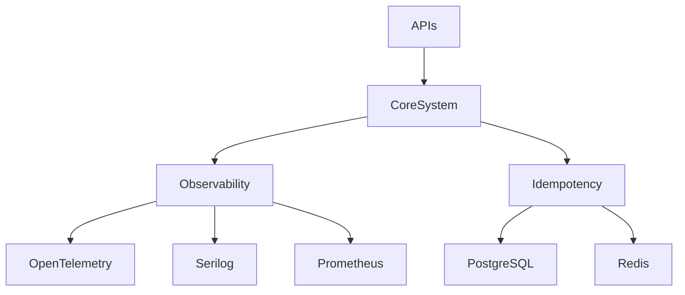

# ⚙️ CoreSystem Ecosystem

<p align="center">
  
  
  
  
  
</p>

<p align="center">
  <b>Cloud-Native • Modular • Observability-First • Production-Ready</b>
</p>

---

# 📖 Overview

**CoreSystem** is a modular ecosystem of reusable .NET libraries focused on simplifying the development of modern distributed systems and high-performance microservices.

The project provides production-ready building blocks for solving common cross-cutting concerns such as:

- Distributed observability
- Request idempotency
- Logging & tracing
- Infrastructure abstraction
- Cloud-native integrations
- Scalable API development

CoreSystem is designed around clean architecture principles, extensibility, and operational excellence.

---

# ✨ Ecosystem Features

| Category | Description |
|---|---|
| 🏗 Modular Architecture | Independent reusable NuGet packages |
| 📊 Observability | OpenTelemetry + Metrics + Logging |
| ⚡ High Performance | Optimized middleware-first design |
| 🧩 Extensibility | Provider-based architecture |
| ☁ Cloud-Native | Docker & distributed systems ready |
| 🚀 Developer Experience | Minimal setup & plug-and-play integrations |

---

# 🧠 Ecosystem Architecture



---

# 📦 Available Packages

| Package | Description | Status |
|---|---|---|
| `FGutierrez.Core.Observability` | OpenTelemetry, Serilog, Metrics & Health Checks | ✅ Stable |
| `FGutierrez.Core.Idempotency` | Distributed idempotency middleware with Redis/PostgreSQL | ✅ Stable |

---

# ⚡ FGutierrez.Core.Observability

Production-grade observability integrations for ASP.NET Core applications.

## Features

- OpenTelemetry tracing
- Runtime & HTTP metrics
- Serilog integration
- Health checks
- OTLP exporter support
- Prometheus-ready metrics

## Included Components

```text
Extensions/
├── HealthCheckEndpointsExtensions.cs
├── HealthCheckExtensions.cs
├── OpenTelemetryMetricsExtensions.cs
├── OpenTelemetryTracingExtensions.cs
└── SerilogExtensions.cs
```

---

# 🎟️ FGutierrez.Core.Idempotency

Distributed idempotency engine for ensuring critical operations execute exactly once.

## Features

- Redis provider
- PostgreSQL provider
- Response replay support
- Duplicate request prevention
- OpenTelemetry metrics
- Middleware-based execution pipeline

## Internal Architecture

```text
Storage/
├── PostgreSQL/
│   └── PostgresIdempotencyStorage.cs
└── Redis/
    └── RedisIdempotencyStorage.cs
```

---

# 🏗 Repository Structure

```text
CoreSystem/
│
├── src/
│   ├── Core.Observability/
│   │   ├── Extensions/
│   │   ├── Options/
│   │   └── ObservabilityDependencyInjection.cs
│   │
│   └── Core.Idempotency/
│       ├── Middleware/
│       ├── Storage/
│       │   ├── PostgreSQL/
│       │   └── Redis/
│       ├── Diagnostics/
│       ├── Models/
│       ├── Options/
│       └── Extensions/
│       └── IdempotencyExtensions.cs

│
├── samples/
│   └── Minimal.Test.Api/
│       ├── docker-compose.yml
│       ├── prometheus.yml
│       ├── otel-collector-config.yml
│       └── Program.cs
│
├── .github/
│   └── workflows/
│
├── LICENSE.txt
├── global.json
├── CoreSystem.sln
└── README.md
```

---

# 🏗 Technology Stack

## Backend

- .NET 8
- ASP.NET Core Minimal APIs
- Dapper
- Middleware Pipeline

## Observability

- OpenTelemetry
- Serilog
- Prometheus
- OTLP Exporter

## Infrastructure

- PostgreSQL
- Redis
- Docker
- Grafana

---

# 🚀 Getting Started

## Clone Repository

```bash
git clone https://github.com/FEDERIN/CoreSystem.git
```

---

## Build Solution

```bash
dotnet build
```

---

## Run Sample API

```bash
cd samples/Minimal.Test.Api
dotnet run
```

---

## Run Full Observability Stack

```bash
docker compose up -d
```

This launches:

- PostgreSQL
- Redis
- OpenTelemetry Collector
- Prometheus
- Grafana

---

# 📊 Observability Stack

CoreSystem promotes an **Observability-First** engineering model.

Included integrations:

| Component | Purpose |
|---|---|
| OpenTelemetry | Distributed tracing |
| Prometheus | Metrics collection |
| Grafana | Visualization dashboards |
| Serilog | Structured logging |
| Health Checks | Runtime monitoring |

---

# 🧪 Engineering Principles

CoreSystem follows modern backend engineering practices:

- Clean Architecture
- SOLID principles
- Middleware-first integrations
- Provider-based extensibility
- High cohesion / low coupling
- Production-grade defaults
- Cloud-native development

---

# 📌 Current Focus

## Completed

- [x] Distributed Observability
- [x] Idempotency Engine
- [x] Redis Support
- [x] PostgreSQL Support
- [x] OpenTelemetry Integration

## Planned

- [ ] Distributed Messaging
- [ ] JWT Security Components
- [ ] Rate Limiting
- [ ] Distributed Cache
- [ ] API Gateway Utilities
- [ ] Kubernetes Helpers

---

# 🤝 Contributing

Contributions, ideas, and improvements are welcome.

## Development Workflow

1. Fork the repository
2. Create a feature branch
3. Commit your changes
4. Open a Pull Request

---

# 📄 License

MIT License © Federin Pastor Gutierrez Ortiz

---

# ⭐ Support

If this ecosystem helps you, consider giving the repository a star on GitHub.