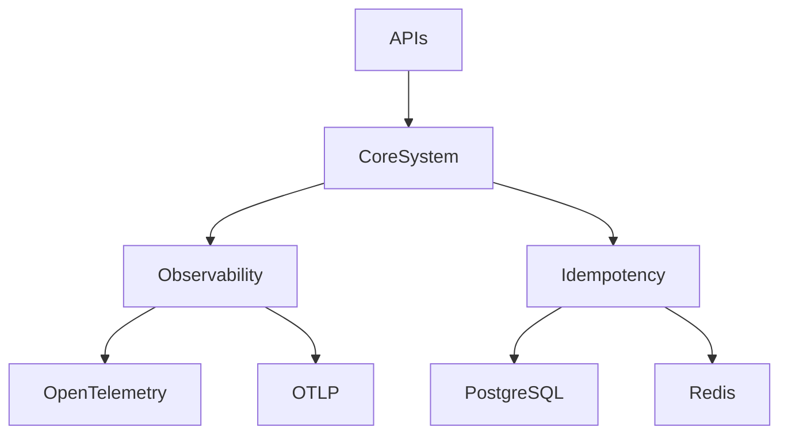

# ⚙️ CoreSystem Ecosystem

<p align="center">
  
  
  
  
  
</p>

<p align="center">
  <b>Cloud-Native • Modular • Observability-First • Production-Ready</b>
</p>

---

# 📖 Overview

**CoreSystem** is a modular ecosystem of reusable .NET libraries focused on simplifying the development of modern distributed systems and high-performance microservices.

The project provides production-ready building blocks for solving common cross-cutting concerns such as:

- Distributed observability
- Request idempotency
- Logging & tracing
- Infrastructure abstraction
- Cloud-native integrations
- Scalable API development

CoreSystem is designed around clean architecture principles, extensibility, and operational excellence.

---

# 🌍 Ecosystem Vision

CoreSystem aims to become a complete toolkit for building modern .NET distributed systems.

Current focus:

- Observability
- Idempotency

Future modules:

- Distributed Messaging
- Security
- Rate Limiting
- Distributed Cache
- Service Discovery
- Resilience Patterns
- API Gateway Utilities

---

# ✨ Ecosystem Features

| Category | Description |
|---|---|
| 🏗 Modular Architecture | Independent reusable NuGet packages |
| 📊 Observability | OpenTelemetry-based telemetry |
| ⚡ High Performance | Optimized middleware-first design |
| 🧩 Extensibility | Provider-based architecture |
| ☁ Cloud-Native | Docker & distributed systems ready |
| 🚀 Developer Experience | Minimal setup & plug-and-play integrations |

---

# 🎯 Design Principles

CoreSystem follows a set of engineering principles:

- OpenTelemetry First
- Cloud-Native by Design
- Middleware-Centric Architecture
- Provider-Based Extensibility
- Production-Ready Defaults
- Low Coupling / High Cohesion
- Minimal Configuration
- Developer Experience Focused

---

# 🧠 Ecosystem Architecture



---

# 🚀 Latest Releases

| Package | Latest Version |
|----------|----------|
| FGutierrez.Core.Observability | 1.1.3 |
| FGutierrez.Core.Idempotency | 1.2.0 |

---

# 📦 Available Packages

| Package | Description | Status |
|---|---|---|
| `FGutierrez.Core.Observability` | OpenTelemetry, Serilog, Metrics & Health Checks | ✅ Stable |
| `FGutierrez.Core.Idempotency` | Distributed idempotency middleware with Redis/PostgreSQL | ✅ Stable |

---

# ⚡ FGutierrez.Core.Observability

Production-grade observability integrations for ASP.NET Core applications.

## Features

- OpenTelemetry tracing
- Runtime metrics
- HTTP metrics
- Structured logging
- Serilog integration
- Health checks
- OTLP exporter support
- Automatic telemetry correlation

## Included Components

```text
Extensions/
├── HealthCheckEndpointsExtensions.cs
├── HealthCheckExtensions.cs
├── OpenTelemetryMetricsExtensions.cs
├── OpenTelemetryTracingExtensions.cs
└── SerilogExtensions.cs
```

---

# 🎟️ FGutierrez.Core.Idempotency

Distributed idempotency engine for ensuring critical operations execute exactly once.

## Features

- Redis provider
- PostgreSQL provider
- Response replay support
- Duplicate request prevention
- OpenTelemetry metrics
- Middleware-based execution pipeline
- Configurable expiration policies

## Internal Architecture

```text
Storage/
├── PostgreSQL/
│   └── PostgresIdempotencyStorage.cs
└── Redis/
    └── RedisIdempotencyStorage.cs
```

---

# 🏗 Repository Structure

```text
CoreSystem/
│
├── docs/
│
├── src/
│   │
│   ├── Core.Observability/
│   │   ├── Extensions/
│   │   ├── Options/
│   │   ├── ObservabilityDependencyInjection.cs
│   │   ├── LICENSE
│   │   └── README.md
│   │
│   └── Core.Idempotency/
│       ├── Middleware/
│       ├── Storage/
│       │   ├── PostgreSQL/
│       │   └── Redis/
│       ├── Diagnostics/
│       ├── Models/
│       ├── Options/
│       ├── Extensions/
│       ├── IdempotencyExtensions.cs
│       ├── LICENSE
│       └── README.md
│
├── samples/
│   └── Minimal.Test.Api/
│       ├── grafana/
│       ├── docker-compose.yml
│       ├── prometheus.yml
│       ├── otel-collector-config.yml
│       └── Program.cs
│
├── .github/
│   └── workflows/
│
├── CHANGELOG.md
├── LICENSE
├── global.json
├── CoreSystem.sln
└── README.md
```

---

# 🏗 Technology Stack

## Backend

- .NET 8
- ASP.NET Core Minimal APIs
- Dapper
- Middleware Pipeline

## Observability

- OpenTelemetry
- Serilog
- OTLP Exporter

## Infrastructure

- PostgreSQL
- Redis
- Docker

---

# 🚀 Getting Started

## Clone Repository

```bash
git clone https://github.com/FEDERIN/CoreSystem.git
```

## Build Solution

```bash
dotnet build
```

## Run Sample API

```bash
cd samples/Minimal.Test.Api
dotnet run
```

## Run Full Local Stack

```bash
docker compose up -d
```

This launches:

- PostgreSQL
- Redis
- OpenTelemetry Collector
- Sample dashboards and monitoring tools

---

# 📊 Telemetry Ecosystem

CoreSystem follows an **OpenTelemetry-first** approach.

Telemetry is exported through the OpenTelemetry Protocol (OTLP), making the ecosystem vendor-neutral and backend-agnostic.

Supported platforms include:

- Grafana
- Jaeger
- Prometheus
- Datadog
- New Relic
- Elastic
- Azure Monitor
- Any OTLP-compatible backend

```text
Application
      │
      ▼
OpenTelemetry SDK
      │
      ▼
OTLP Exporter
      │
      ▼
Collector / Backend
```

---

# 🧪 Engineering Principles

CoreSystem follows modern backend engineering practices:

- Clean Architecture
- SOLID Principles
- Middleware-First Integrations
- Provider-Based Extensibility
- High Cohesion / Low Coupling
- Production-Grade Defaults
- Cloud-Native Development
- Observability by Default

---

# 📌 Current Focus

## Completed

- [x] Distributed Observability
- [x] Idempotency Engine
- [x] Redis Support
- [x] PostgreSQL Support
- [x] OpenTelemetry Integration

## Planned

- [ ] Distributed Messaging
- [ ] JWT Security Components
- [ ] Rate Limiting
- [ ] Distributed Cache
- [ ] API Gateway Utilities
- [ ] Kubernetes Helpers
- [ ] Service Discovery
- [ ] Resilience Policies

---

# 📦 Package Publishing

This repository uses GitHub Actions to automate NuGet packaging and publishing.

To publish a package, create a Git tag using the following format:

```text
<ProjectName>/v<Major>.<Minor>.<Patch>
```

Example:

```bash
git tag FGutierrez.Core.Idempotency/v1.2.0
git push origin FGutierrez.Core.Idempotency/v1.2.0
```

The GitHub workflow will automatically:

1. Build the package
2. Generate the NuGet artifact
3. Publish it to NuGet.org
4. Create the corresponding GitHub Release

---

# 🤝 Contributing

Contributions, ideas, and improvements are welcome.

## Development Workflow

1. Fork the repository
2. Create a feature branch
3. Commit your changes
4. Open a Pull Request

---

# 📄 License

MIT License © Federin Pastor Gutierrez Ortiz

See the LICENSE file for details.

---

# ⭐ Support

If this ecosystem helps you, consider giving the repository a star on GitHub.

Building modern .NET distributed systems, one reusable component at a time.