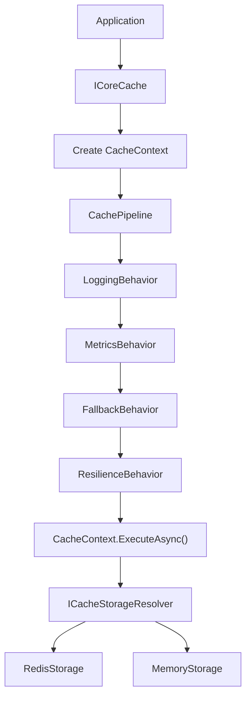
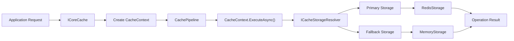
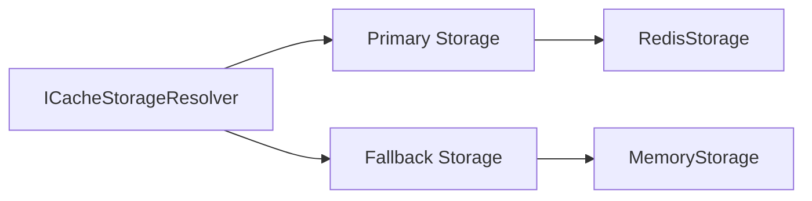
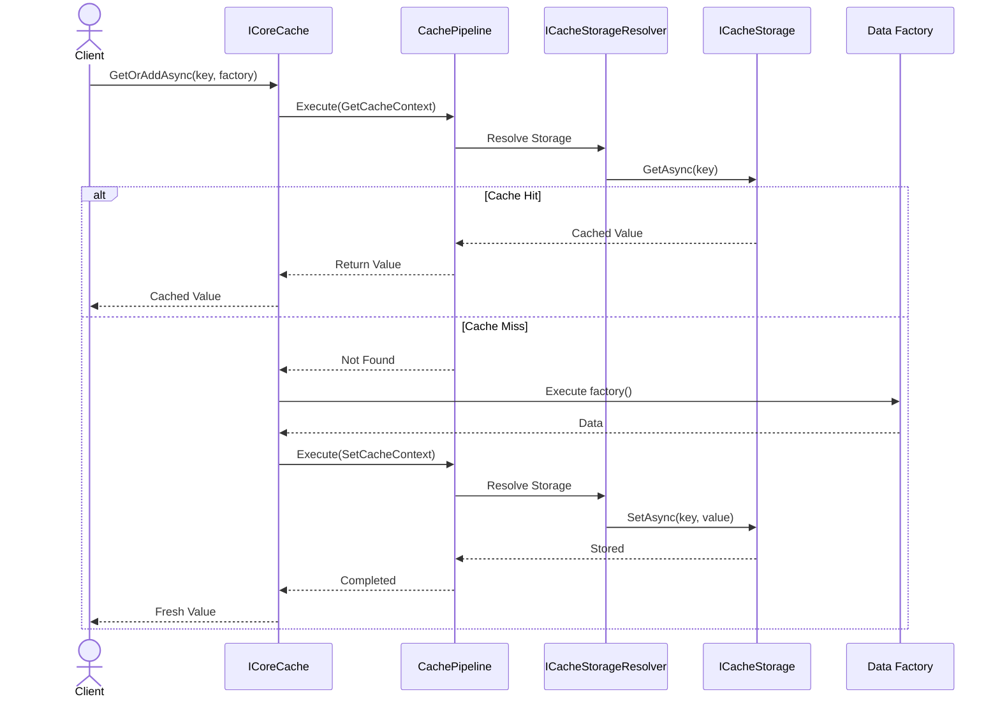

# 🏗️ Architecture

`CoreSystem.Cache` is built around a composable pipeline architecture that separates cache operations from storage implementations.

Instead of interacting directly with Redis or Memory, every cache operation is represented by a `CacheContext` and executed through the `CachePipeline`. During execution, cross-cutting concerns such as logging, metrics, resilience, and automatic fallback are applied before the operation reaches the selected storage provider.

This architecture keeps business code independent from infrastructure concerns while allowing new behaviors and storage providers to be introduced without changing the public API.



---

## 🎯 Design Goals

The framework is designed around a few core architectural principles:

- Keep business code independent from storage providers.
- Centralize cross-cutting concerns through a composable execution pipeline.
- Support multiple cache providers behind a single abstraction.
- Allow new behaviors to be introduced without modifying the cache service.
- Keep storage implementations isolated from application code.

---

# 🏛️ Architectural Patterns

`CoreSystem.Cache` is built on a combination of well-established architectural and design patterns. Each pattern addresses a specific concern while keeping the framework modular, extensible, and maintainable.

| Pattern | Purpose |
|----------|---------|
| **Pipeline** | Executes every cache operation through a configurable chain of reusable behaviors. |
| **Chain of Responsibility** | Allows each behavior to observe, enrich, or modify an operation before delegating to the next behavior. |
| **Strategy** | Enables interchangeable implementations for storage providers, serializers, and distributed locks. |
| **Factory** | Creates operation-specific `CacheContext` instances that encapsulate the execution state for each cache operation. |
| **Provider Pattern** | Abstracts Memory and Redis behind a common `ICacheStorage` interface. |
| **Cache-Aside** | Simplifies cache population through the built-in `GetOrAddAsync()` workflow. |

These patterns work together to separate business logic from infrastructure concerns while allowing new behaviors and storage providers to be introduced without changing the public API.

---

# 🧩 Core Components

The framework is composed of a small set of components, each with a clearly defined responsibility.

| Component | Responsibility |
|-----------|----------------|
| **ICoreCache** | Public entry point for all cache operations. Creates the appropriate `CacheContext` and delegates execution to the pipeline. |
| **CacheContext** | Represents a single cache operation. Encapsulates its state, execution logic, and selected storage provider. |
| **CachePipeline** | Coordinates the execution of every cache operation through a chain of reusable behaviors before delegating to the selected storage provider. |
| **ICacheBehavior** | Defines reusable cross-cutting behaviors such as logging, metrics, resilience, and fallback. |
| **ICacheStorageResolver** | Resolves the primary and fallback storage providers for the current operation. |
| **ICacheStorage** | Provider-agnostic abstraction implemented by every storage provider. |

The interaction between these components keeps the public API small while allowing the infrastructure to evolve independently.

---

# 🔄 Execution Lifecycle

Every cache operation follows the same execution lifecycle regardless of the operation type or selected storage provider.

The application communicates only with `ICoreCache`. A specialized `CacheContext` is created for the requested operation, then executed through the `CachePipeline`. Each registered behavior may observe, enrich, or modify the execution before the operation reaches the selected storage provider.



During execution, behaviors such as logging, metrics, resilience policies, and automatic fallback are applied transparently.

Because these concerns are implemented as reusable pipeline behaviors, additional capabilities such as compression, encryption, tracing, or auditing can be introduced without modifying either the cache service or the storage providers.

---

# ⚙️ Pipeline Behaviors

The `CachePipeline` executes each registered behavior sequentially before delegating the operation to the selected storage provider.

Each behavior has a single responsibility.

| Behavior | Responsibility |
|----------|----------------|
| **LoggingBehavior** | Logs cache operations and failures. |
| **MetricsBehavior** | Records cache metrics using OpenTelemetry. |
| **FallbackBehavior** | Switches to the fallback provider when the primary provider becomes unavailable. |
| **ResilienceBehavior** | Executes cache operations through configured Polly resilience policies. |

Because behaviors are independent, the pipeline can evolve without changing the public API.

Potential future behaviors include:

- Compression
- Encryption
- Tracing
- Auditing
- Validation
- Rate limiting

---

# 🗄️ Storage Layer

The storage layer is completely independent from the execution pipeline.

Every storage provider implements the same `ICacheStorage` abstraction, allowing providers to be exchanged transparently during execution.



### Redis Storage

```text
RedisStorage
│
├── PayloadSerializer
├── RedisTagIndex
├── RedisLockProvider
└── RedisKeyBuilder
```

### Memory Storage

```text
MemoryStorage
│
├── MemoryTagIndex
├── MemoryLockProvider
├── MemoryKeyTracker
└── CacheEntryFactory
```

Because both providers implement the same abstraction, the pipeline can switch providers transparently without affecting application code.

---

# ⚡ Cache-Aside Execution

The framework provides a built-in implementation of the Cache-Aside pattern through `GetOrAddAsync()`.



Because every cache operation shares the same execution pipeline, cross-cutting concerns such as logging, metrics, resilience, fallback, and future behaviors are applied consistently across the entire framework.

---