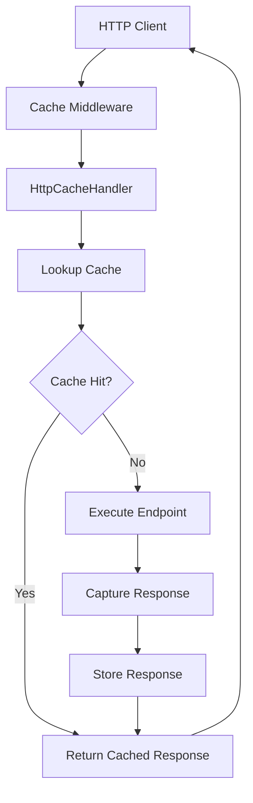

# 🌐 HTTP Response Caching

`FGutierrez.Core.DistributedCache` provides declarative HTTP response caching for ASP.NET Core applications.

Instead of implementing cache management logic inside controllers or Minimal APIs, the framework automatically handles cache lookup, storage, expiration, and invalidation through middleware.

---

# Overview

When an endpoint is decorated with the `Cacheable` attribute, the framework automatically:

- Generates a cache key
- Checks whether a cached response already exists
- Returns cached responses immediately
- Executes the endpoint on cache misses
- Captures successful responses
- Stores responses using the configured cache provider
- Applies expiration policies
- Supports tag-based invalidation

No additional code is required inside your endpoints.

---

# Architecture



---

# Enable the Middleware

Register the middleware.

```csharp
var app = builder.Build();

app.UseCoreDistributedCache();

app.Run();
```

---

# Basic Usage

Decorate an endpoint.

```csharp
[HttpGet("{id}")]
[Cacheable(expirationSeconds:300)]
public async Task<IActionResult> Get(Guid id)
{
    return Ok(await service.GetAsync(id));
}
```

The response will be cached for five minutes.

---

# Minimal API Example

```csharp
app.MapGet("/products/{id}",
    async (Guid id, IProductService service) =>
    {
        return Results.Ok(await service.GetAsync(id));
    })
.WithMetadata(new CacheableAttribute(300));
```

---

# Cache Expiration

Specify the cache lifetime.

```csharp
[Cacheable(expirationSeconds:600)]
```

or

```csharp
[Cacheable(expirationSeconds:60)]
```

---

# Using Cache Tags

Tags allow multiple cached responses to be invalidated together.

```csharp
[Cacheable(
    expirationSeconds:300,
    tag:"Products")]
```

Later:

```csharp
await cache.InvalidateByTagAsync("Products");
```

---

# Cache Key Generation

Cache keys are generated automatically using:

- Instance name
- HTTP method
- Request path
- Query string

Example:

```text
catalog-api:GET:/products/15?page=2
```

This guarantees different URLs are cached independently.

---

# Cache Hit

```
Request
      │
      ▼
Cached Response Exists?
      │
     Yes
      │
      ▼
Return Cached Response
```

No endpoint execution occurs.

---

# Cache Miss

```
Request
      │
      ▼
Cache Miss
      │
      ▼
Execute Endpoint
      │
      ▼
Capture Response
      │
      ▼
Store Response
      │
      ▼
Return Response
```

---

# Provider Independence

HTTP response caching works with any configured provider.

Supported providers:

- Memory
- Redis

Changing providers requires no changes to controllers.

---

# Pipeline Integration

Every HTTP cache operation executes through the cache pipeline.

```text
Logging

↓

Metrics

↓

Fallback

↓

Resilience

↓

Storage
```

This means HTTP response caching automatically benefits from:

- Logging
- OpenTelemetry Metrics
- Automatic Redis fallback
- Resilience policies

---

# Best Practices

✅ Cache GET endpoints only.

✅ Avoid caching endpoints with user-specific responses.

✅ Use cache tags for related resources.

✅ Choose expiration based on data volatility.

✅ Use Redis in production.

---

# Limitations

HTTP response caching should not be used for:

- Authentication endpoints
- Authorization endpoints
- Payment operations
- Highly personalized responses
- Streaming endpoints