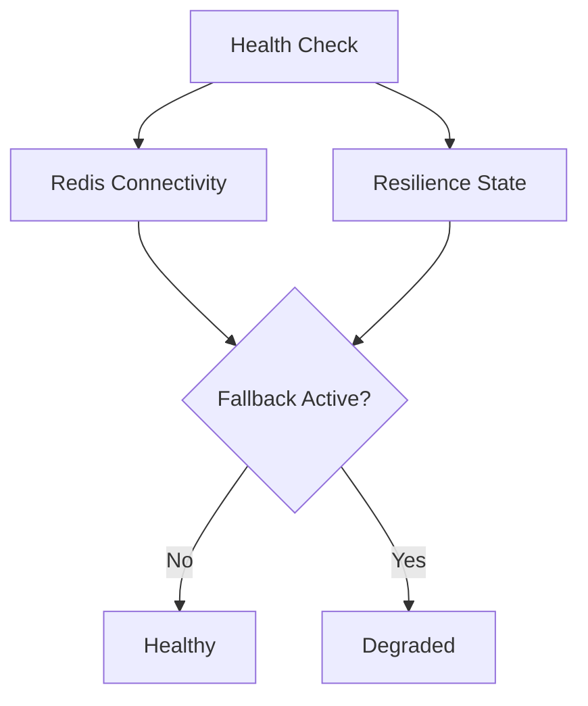

# 🩺 Health Checks

CoreSystem.Cache integrates with the ASP.NET Core Health Checks infrastructure to provide visibility into the operational state of the cache layer.

Unlike a simple Redis connectivity check, the framework reports the actual health of the caching infrastructure, including whether the application is currently operating with the primary provider or using the configured fallback storage.

---

# Why It Matters

In production environments, cache infrastructure can become temporarily unavailable.

Rather than failing requests immediately, the framework can automatically switch to the fallback provider while continuing to serve traffic.

The Health Check reflects this state so that monitoring systems can distinguish between:

- A healthy cache infrastructure.
- A degraded cache infrastructure operating in fallback mode.

---

# Registering Health Checks

Register the ASP.NET Core Health Checks service.

```csharp
builder.Services.AddHealthChecks();
```

When `AddCoreDistributedCache()` is called, the framework automatically registers its own health check.

No additional configuration is required.

---

# Expose the Health Endpoint

Expose the health endpoint as usual.

```csharp
app.MapHealthChecks("/health");
```

Example:

```
GET /health
```

---

# Health States

The framework reports two operational states.

| Status | Description |
|---------|-------------|
| 🟢 Healthy | Redis is available and all cache operations are executed using the primary provider. |
| 🟡 Degraded | Redis is unavailable and the framework is serving requests using the fallback Memory provider. |

Because the fallback provider keeps the application running, a degraded state does not necessarily indicate application failure.

---

# How It Works



The health check combines information from:

- Redis connectivity.
- The resilience pipeline.
- The current fallback state.

This provides a more accurate health report than a simple Redis ping.

---

# Example Response

Healthy

```json
{
  "status": "Healthy"
}
```

Degraded

```json
{
  "status": "Degraded"
}
```

---

# Monitoring

The health endpoint can be consumed by:

- Kubernetes
- Azure App Service
- Docker
- Prometheus
- Grafana
- Azure Monitor
- Any ASP.NET Core compatible monitoring platform

---

# Operational Recommendations

## Healthy

No action required.

The framework is operating normally.

---

## Degraded

The application is currently using the in-memory fallback provider.

Recommended actions:

- Verify Redis availability.
- Review Redis logs.
- Check network connectivity.
- Confirm that Redis authentication is valid.

Once Redis becomes available again, the framework automatically resumes using the primary provider.

---

# Cache Rehydration

If automatic cache rehydration is enabled, entries stored in memory while Redis was unavailable are synchronized back to Redis after connectivity is restored.

This process runs automatically in the background.

No manual intervention is required.

---

# Best Practices

- Always expose the health endpoint.
- Monitor degraded states instead of only failures.
- Combine Health Checks with OpenTelemetry metrics.
- Use readiness probes in Kubernetes.
- Configure alerts for prolonged degraded states.

---

# Next Step

Continue with:

➡️ **09-extensibility.md**