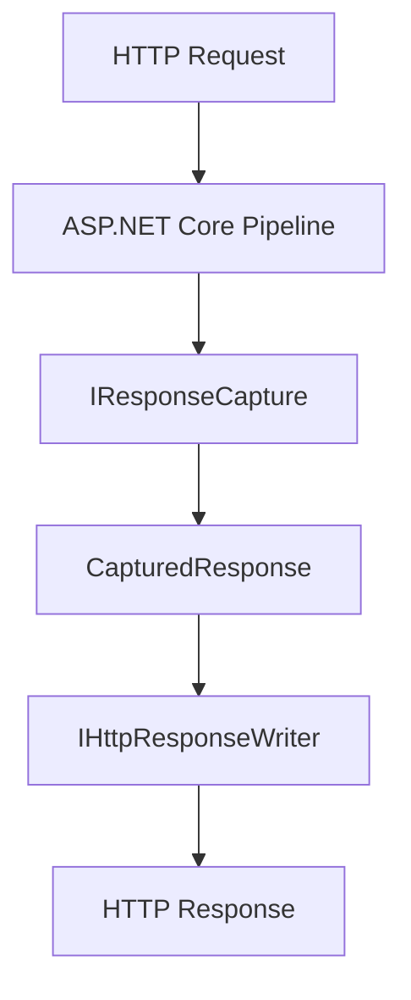
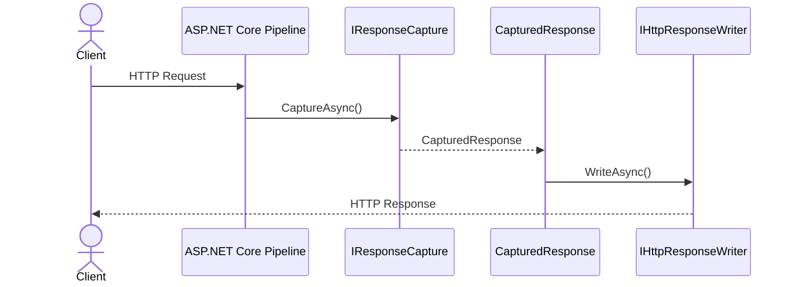
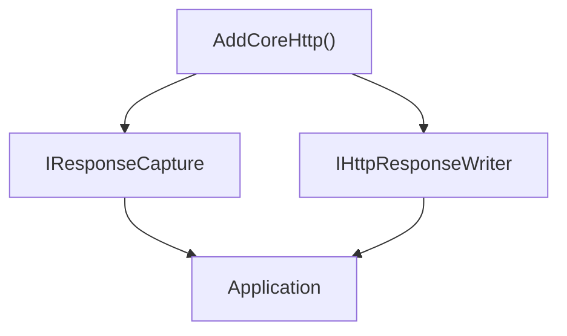
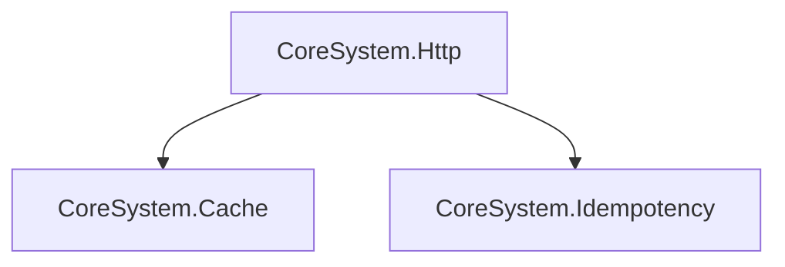

# 🏗️ Architecture

`CoreSystem.Http` is built around a simple architectural principle:

> **Capture an HTTP response once and replay it anywhere.**

Rather than embedding response capture logic into individual middleware or application features, CoreSystem.Http extracts this functionality into reusable infrastructure that can be shared across libraries and applications.

The framework separates response capture from response replay, providing a small and stable public API while handling HTTP-specific behavior internally.

---

# Architectural Overview

Applications interact only with the public abstractions exposed by the framework.

`IResponseCapture` captures the HTTP response generated by the ASP.NET Core pipeline and stores it as a `CapturedResponse`.

Later, `IHttpResponseWriter` can replay the captured response without executing the original request pipeline again.

This architecture separates response capture from response replay while allowing higher-level features to reuse both independently.

---

# Design Goals

CoreSystem.Http is intentionally focused on a single responsibility.

The framework is designed around the following principles.

- Capture HTTP responses reliably.
- Replay responses consistently.
- Preserve HTTP semantics.
- Keep infrastructure reusable.
- Minimize public API surface.
- Integrate naturally with Dependency Injection.
- Remain lightweight and dependency-free.

---

# Architectural Patterns

CoreSystem.Http combines several well-established software design patterns.

| Pattern | Purpose |
|----------|---------|
| **Strategy** | Separates response capture from response replay. |
| **Provider** | Resolves framework services through Dependency Injection. |
| **DTO** | Represents captured responses using `CapturedResponse`. |
| **Facade** | Exposes a minimal API for higher-level frameworks. |

These patterns keep the framework simple while allowing the implementation to evolve independently.

---

# Core Components

The framework consists of a small number of focused components.

| Component | Responsibility |
|-----------|----------------|
| **IResponseCapture** | Captures the HTTP response generated by the ASP.NET Core pipeline. |
| **IHttpResponseWriter** | Writes a previously captured response back to the current `HttpContext`. |
| **CapturedResponse** | Represents a captured HTTP response including status code, headers, content type and body. |
| **HttpRegistration** | Registers all CoreSystem.Http services with Dependency Injection. |

---

# Response Capture

During request execution, the framework temporarily replaces the response body stream with an in-memory buffer.

Once the request pipeline finishes executing, the response is captured and the original response stream is restored.

This process is completely transparent to the application.

---

# Response Replay

Previously captured responses can be replayed without executing the original ASP.NET Core pipeline.

The framework restores:

- HTTP status code
- Response headers
- Content type
- Response body

while preserving HTTP behavior such as `HEAD` requests.

---

# Execution Lifecycle

Every captured response follows the same lifecycle.

The application only interacts with the public abstractions while the framework manages the HTTP infrastructure.

---

# Dependency Injection

The framework integrates with the standard ASP.NET Core Dependency Injection container.

Applications depend only on framework abstractions.

---

# Design Principles

When extending the framework, follow these principles.

- Single Responsibility Principle
- Composition over inheritance
- Stateless services
- Asynchronous APIs
- Preserve HTTP semantics
- Prefer abstractions over concrete implementations
- Keep the public API minimal

Following these principles helps ensure that custom extensions remain consistent with the framework architecture.

---

# Integration with CoreSystem

CoreSystem.Http is designed as foundational infrastructure.

Higher-level libraries build upon it without duplicating HTTP response handling.

This separation allows HTTP infrastructure to evolve independently from application features.

---

# Summary

CoreSystem.Http provides reusable infrastructure for capturing and replaying HTTP responses.

By separating response capture from response replay, the framework enables higher-level features such as caching, idempotency, auditing and middleware development without duplicating HTTP infrastructure.

Its minimal API, lightweight design and clear separation of responsibilities make it suitable as a foundational building block for the CoreSystem ecosystem.