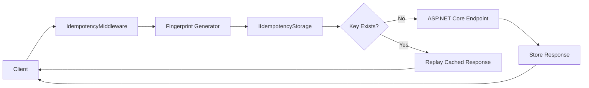
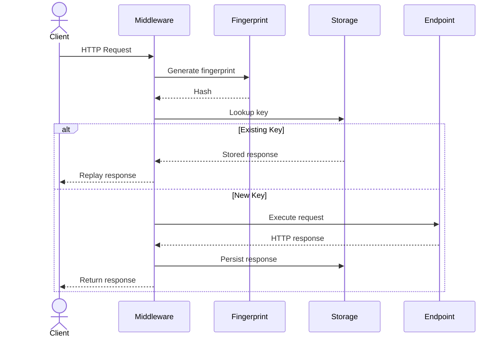
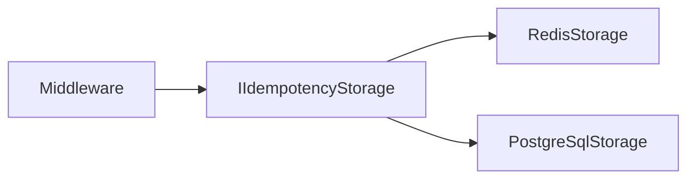

# 🏗️ Architecture

`CoreSystem.Idempotency` is built around a middleware-centric architecture that guarantees a request is executed only once.

Instead of allowing every incoming request to reach the application, the middleware intercepts the request, validates the idempotency key, generates a request fingerprint, and consults the configured storage provider before deciding whether the request should be executed or a previously stored response should be returned.

This design separates idempotency concerns from application code while allowing different storage providers to be introduced without changing the public API.

---

# 🎯 Design Goals

CoreSystem.Idempotency is designed around a few core principles:

- Execute business operations exactly once.
- Keep application code independent from storage implementations.
- Detect request modifications through fingerprinting.
- Support multiple distributed storage providers.
- Keep infrastructure concerns isolated from business logic.

---

# 🏛️ Architectural Patterns

The framework combines a small set of architectural patterns.

| Pattern | Purpose |
|----------|---------|
| **Middleware** | Intercepts every incoming HTTP request before it reaches the application. |
| **Strategy** | Allows different storage providers and fingerprint algorithms to be selected. |
| **Provider Pattern** | Abstracts Redis and PostgreSQL behind a common `IIdempotencyStorage` interface. |
| **Decorator** | Wraps the request execution to capture and persist the generated response. |

Together, these patterns keep the framework extensible while minimizing the impact on application code.

---

# 🧩 Core Components

The framework is composed of the following components.

| Component | Responsibility |
|-----------|----------------|
| **IdempotencyMiddleware** | Intercepts requests and coordinates the idempotency workflow. |
| **IRequestFingerprintGenerator** | Generates a deterministic fingerprint for each request. |
| **IIdempotencyStorage** | Stores and retrieves idempotent responses. |
| **IIdempotencyKeyGenerator** | Generates unique idempotency keys when required. |
| **IResponseCapture** | Captures the HTTP response for later replay. |

Each component has a single responsibility and can evolve independently.

---

# 🔄 Request Lifecycle

Every request follows the same execution flow.

---

# 🔐 Request Fingerprinting

Every request is transformed into a deterministic fingerprint before storage lookup.

The fingerprint may include:

- HTTP method
- Request path
- Query string
- Request body
- Selected HTTP headers

If the same idempotency key is reused with a different fingerprint, the middleware rejects the request by throwing an `IdempotencyFingerprintMismatchException`.

See **Fingerprinting** for details.

---

# 🗄️ Storage Layer

The storage layer is completely independent from the middleware.

Every provider implements the same abstraction.

Current providers:

- Redis
- PostgreSQL

Additional providers can be introduced without modifying the middleware.

---

# ♻️ Response Replay

After a successful request execution, the framework stores:

- Status code
- Response headers
- Response body
- Request fingerprint
- Expiration metadata

When an identical request is received with the same idempotency key, the stored response is replayed immediately without executing the application endpoint again.

This guarantees that business operations are executed exactly once while providing consistent responses to clients.