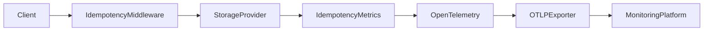

# 📊 Observability

`CoreSystem.Idempotency` includes built-in **OpenTelemetry** instrumentation.

The framework automatically publishes metrics describing request processing, response replay, storage activity, and payload characteristics without requiring changes to application code.

---

# Why Observability Matters

Idempotency protects critical business operations, but understanding how those operations behave in production is equally important.

Built-in telemetry helps answer questions such as:

- How many idempotent requests are processed?
- How many duplicate requests are detected?
- How often are cached responses replayed?
- How long do storage operations take?
- How many responses are persisted?
- What is the average response payload size?

---

# Architecture



---

# Built-in Metrics

The framework automatically publishes the following metrics.

| Metric | Type | Description |
|----------|------|-------------|
| `idempotency.requests` | Counter | Total idempotent requests processed by the middleware. |
| `idempotency.cache.hits` | Counter | Requests served from the configured storage provider. |
| `idempotency.cache.misses` | Counter | Requests that required normal endpoint execution. |
| `idempotency.response.replays` | Counter | Cached responses replayed to the client. |
| `idempotency.storage.writes` | Counter | Responses persisted to the storage provider. |
| `idempotency.storage.read.duration` | Histogram | Duration of storage read operations in milliseconds. |
| `idempotency.storage.write.duration` | Histogram | Duration of storage write operations in milliseconds. |
| `idempotency.payload.size` | Histogram | Size of serialized response payloads in bytes. |

---

# Understanding the Metrics

## Request Flow

Every idempotent request increments:

```text
idempotency.requests
```

If the request is executed normally:

```text
idempotency.cache.misses
```

If a previously stored response is returned:

```text
idempotency.cache.hits
idempotency.response.replays
```

When a new response is persisted:

```text
idempotency.storage.writes
```

---

## Storage Performance

The framework measures storage latency using histograms.

```text
idempotency.storage.read.duration
idempotency.storage.write.duration
```

These metrics help identify slow Redis or PostgreSQL operations.

---

## Payload Size

The middleware records the size of every persisted response.

```text
idempotency.payload.size
```

This metric is useful for:

- Monitoring storage consumption
- Detecting unusually large responses
- Measuring serialization overhead

---

# Registering the Meter

The package automatically registers the following OpenTelemetry meter.

```text
CoreSystem.Idempotency
```

Applications only need to register the meter with OpenTelemetry.

```csharp
builder.Services
    .AddOpenTelemetry()
    .WithMetrics(metrics =>
    {
        metrics.AddMeter("CoreSystem.Idempotency");
    });
```

---

# Compatible Platforms

The published metrics can be exported to any OTLP-compatible backend.

| Platform | Supported |
|-----------|:---------:|
| Prometheus | ✅ |
| Grafana | ✅ |
| Azure Monitor | ✅ |
| Jaeger | ✅ |
| Elastic | ✅ |
| Datadog | ✅ |
| OTLP | ✅ |

---

# Example Dashboard

Typical dashboards include:

- Total Requests
- Cache Hits
- Cache Misses
- Response Replays
- Storage Read Latency
- Storage Write Latency
- Average Payload Size
- Total Storage Writes

*(Grafana dashboard screenshots can be added here.)*

---

# Best Practices

✅ Monitor the cache hit/miss ratio.

✅ Track response replay frequency.

✅ Monitor storage read and write latency.

✅ Watch for unusually large response payloads.

✅ Export metrics using OTLP.

✅ Configure alerts for abnormal storage latency.

# Related Documentation

- Configuration
- Architecture
- Response Replay
- CoreSystem.Observability