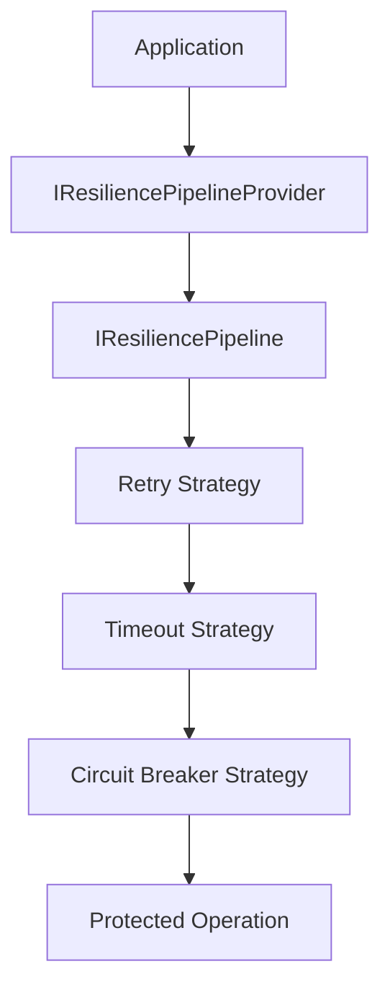
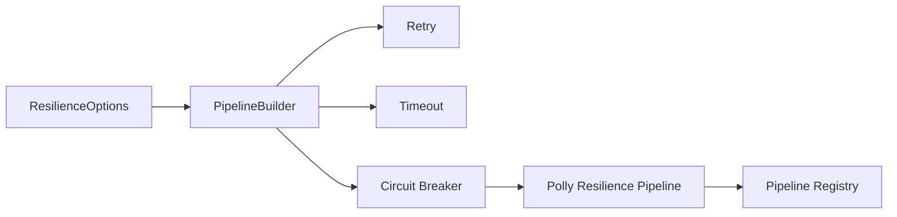
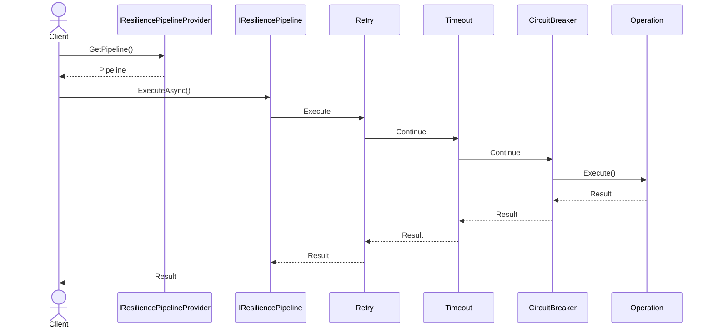
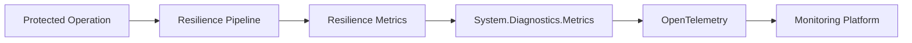
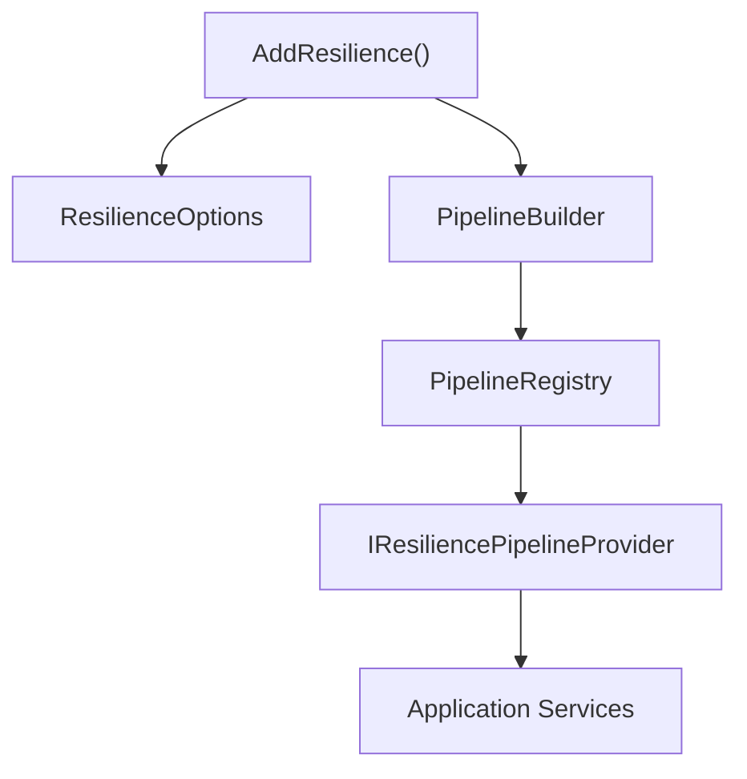

# 🏗️ Architecture

`CoreSystem.Resilience` is built around the concept of **named resilience pipelines**.

Rather than coupling resilience strategies directly to application code, every protected operation is executed through an `IResiliencePipeline`. Each pipeline is composed of one or more resilience strategies, allowing infrastructure concerns to remain isolated from business logic.

The framework provides a lightweight abstraction over Polly while exposing a clean, provider-independent API that can evolve without affecting consuming applications.

---

# Architectural Overview

Applications interact only with the public abstractions exposed by the framework.

The `IResiliencePipelineProvider` resolves a named pipeline, which executes the configured resilience strategies before invoking the protected operation.

This architecture separates business logic from resilience concerns while allowing new strategies to be introduced without changing application code.

---

# Design Goals

The framework is designed around a few core principles.

- Keep business code independent from resilience implementations.
- Hide Polly behind a stable abstraction.
- Support multiple named resilience pipelines.
- Allow strategies to evolve without affecting consumers.
- Integrate naturally with Dependency Injection.
- Publish operational metrics using `System.Diagnostics.Metrics`.

---

# Architectural Patterns

`CoreSystem.Resilience` combines several well-established software design patterns.

| Pattern | Purpose |
|----------|---------|
| **Builder** | Builds resilience pipelines from configuration. |
| **Strategy** | Encapsulates retry, timeout, and circuit breaker behaviors. |
| **Registry** | Stores named resilience pipelines. |
| **Provider** | Resolves pipelines by their logical type. |
| **Factory** | Creates Polly pipelines from framework configuration. |
| **Decorator** | Collects metrics around pipeline execution. |

These patterns keep the public API small while allowing the internal implementation to evolve independently.

---

# Core Components

The framework is composed of a small number of components, each with a single responsibility.

| Component | Responsibility |
|-----------|----------------|
| **IResiliencePipeline** | Executes protected operations through the configured resilience strategies. |
| **IResiliencePipelineProvider** | Resolves resilience pipelines by their logical type. |
| **PipelineBuilder** | Builds Polly pipelines from framework options. |
| **PipelineRegistry** | Stores all registered pipelines. |
| **Retry Strategy Builder** | Configures retry policies. |
| **Timeout Strategy Builder** | Configures timeout policies. |
| **Circuit Breaker Strategy Builder** | Configures circuit breaker policies. |
| **ResilienceMetrics** | Publishes execution metrics using `System.Diagnostics.Metrics`. |

---

# Pipeline Construction

During application startup, the framework builds every configured pipeline.

Each strategy contributes its configuration to the final pipeline before it is registered.

Once registration completes, pipelines become immutable and can be safely reused throughout the application's lifetime.

---

# Execution Lifecycle

Every protected operation follows the same execution flow.

The application resolves a pipeline, which executes each configured resilience strategy before invoking the protected operation.

Each strategy participates transparently in the execution without requiring changes to application code.

---

# Metrics Flow

Every pipeline execution can publish operational metrics.

Metrics are emitted using `System.Diagnostics.Metrics` and can be collected by any OpenTelemetry-compatible exporter.

Typical monitoring platforms include:

- Prometheus
- Grafana
- Azure Monitor
- Datadog
- OTLP-compatible collectors

---

# Dependency Injection

The framework integrates with the standard ASP.NET Core Dependency Injection container.

Applications only depend on the public abstractions exposed by the framework.

---

# Design Principles

When extending the framework, follow these principles.

* Single Responsibility Principle
* Composition over inheritance
* Keep strategies independent
* Prefer abstractions over concrete implementations
* Integrate through dependency injection
* Preserve asynchronous execution
* Maintain provider independence

Following these principles helps ensure that custom extensions remain consistent with the framework architecture.

---

# Summary

`CoreSystem.Resilience` provides a modular architecture for executing protected operations through reusable resilience pipelines.

By combining named pipelines, configurable strategies, dependency injection, and built-in metrics, the framework delivers a clean and extensible resilience layer while keeping application code focused on business logic.