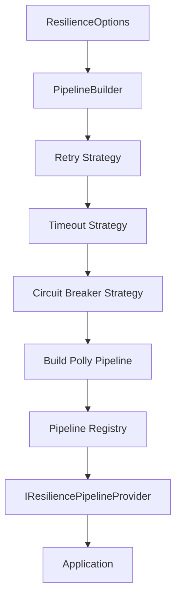
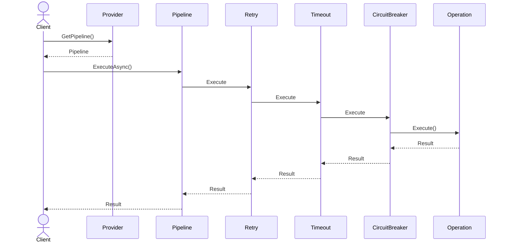

# 🔀 Pipelines

A resilience pipeline represents a reusable execution flow that applies one or more resilience strategies before executing an operation.

Instead of configuring resilience for every individual operation, **CoreSystem.Resilience** allows applications to register named pipelines once and reuse them throughout the application.

---

# Why Pipelines?

Modern applications interact with multiple external resources, each with different resilience requirements.

For example:

- Redis may require retries and short timeouts.
- HTTP services may require retries with exponential backoff.
- Database operations may require longer timeouts but no retries.
- Background jobs may use completely different policies.

By registering multiple pipelines, each workload can have its own resilience configuration while sharing the same programming model.

---

# Pipeline Lifecycle

The following diagram illustrates how a pipeline is created and executed.



---

# Executing a Pipeline

Once resolved, the pipeline protects any asynchronous operation.

```csharp
await _pipeline.ExecuteAsync(async cancellationToken =>
{
    await redis.GetAsync(key, cancellationToken);
});
```

Every configured resilience strategy is applied automatically before the operation is executed.

---

# Execution Flow

Every execution follows the same lifecycle.



---

# Combining Strategies

A pipeline may contain one or multiple resilience strategies.

For example:

| Strategy | Purpose |
|----------|----------|
| Retry | Retries transient failures. |
| Timeout | Prevents excessively long operations. |
| Circuit Breaker | Stops sending requests to unhealthy dependencies. |

Strategies are executed in the order they are registered.

---

# Multiple Pipelines

Applications can register multiple independent pipelines.

```csharp
builder.Services.AddResilience(options =>
{
    options.AddPipeline(PipelineType.Redis, pipeline =>
    {
        pipeline.AddRetry(retry =>
        {
            retry.MaxRetryAttempts = 3;
        });
    });

    options.AddPipeline(PipelineType.Http, pipeline =>
    {
        pipeline.AddRetry(retry =>
        {
            retry.MaxRetryAttempts = 5;
        });

        pipeline.AddTimeout(timeout =>
        {
            timeout.Timeout = TimeSpan.FromSeconds(30);
        });
    });
});
```

Each pipeline is completely independent from the others.

---

# Best Practices

- Register one pipeline for each infrastructure dependency.
- Reuse pipelines instead of creating them dynamically.
- Keep pipeline configurations focused on a single workload.
- Combine strategies only when they provide additional value.
- Prefer centralized registration during application startup.