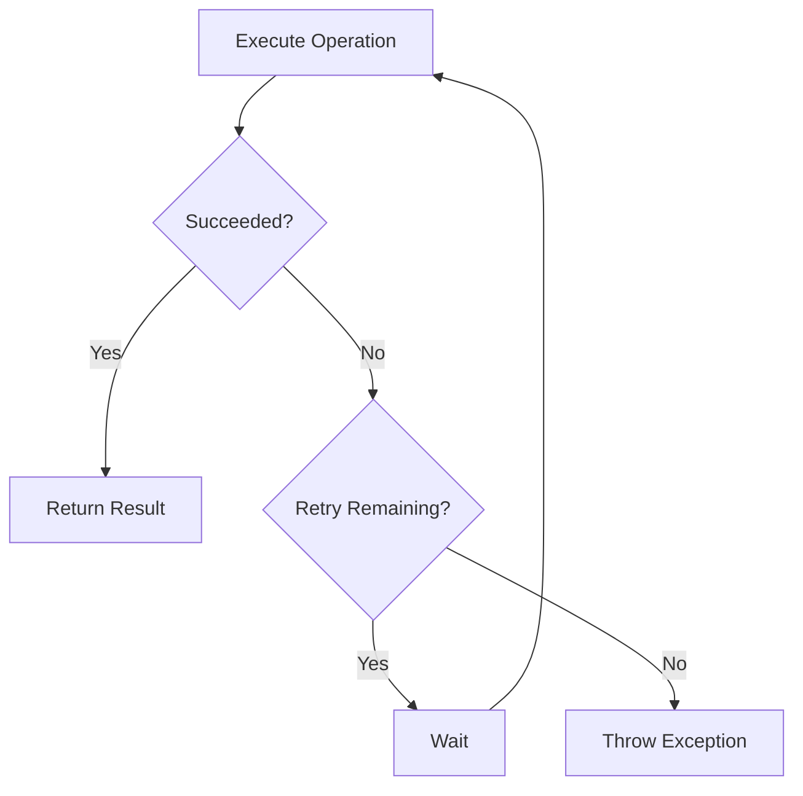

# 🔁 Retry Strategy

The **Retry** strategy automatically retries failed operations when transient failures occur.

Transient failures are temporary issues that are expected to recover after a short period of time, such as network interruptions, temporary service unavailability, or brief infrastructure hiccups.

Rather than immediately propagating these failures to the application, Retry gives the operation additional opportunities to succeed.

---

# Why Retry?

Modern distributed systems communicate with external dependencies such as:

- Redis
- HTTP APIs
- Databases
- Message brokers
- Cloud services

These dependencies can occasionally fail due to temporary conditions.

Common examples include:

- Network latency
- Connection resets
- Temporary overload
- DNS resolution delays
- Service restarts

Retry helps applications recover automatically from these situations without requiring additional business logic.

---

# Basic Configuration

Enable Retry when configuring a pipeline.

```csharp
builder.Services.AddResilience(options =>
{
    options.AddPipeline(PipelineType.Redis, pipeline =>
    {
        pipeline.AddRetry(retry =>
        {
            retry.MaxRetryAttempts = 3;
        });
    });
});
```

In this example, the operation is executed up to **three additional times** before the failure is propagated to the caller.

---

# Configuration Options

| Option | Description | Default |
|----------|-------------|---------|
| Enabled | Enables or disables the strategy. | `true` |
| MaxRetryAttempts | Maximum retry attempts. | `3` |
| Delay | Initial delay between retries. | `00:00:02` |
| BackoffType | Delay calculation strategy. | Exponential |
| UseJitter | Adds random delay to reduce retry storms. | `true` |

---

# Delay Strategies

Retry supports multiple backoff algorithms.

## Constant

Uses the same delay between every retry.

```text
Attempt 1 → 2s

Attempt 2 → 2s

Attempt 3 → 2s
```

Configure:

```csharp
retry.BackoffType = BackoffType.Constant;
```

---

## Linear

The delay increases linearly.

```text
Attempt 1 → 2s

Attempt 2 → 4s

Attempt 3 → 6s
```

Configure:

```csharp
retry.BackoffType = BackoffType.Linear;
```

---

## Exponential

The delay grows exponentially.

```text
Attempt 1 → 2s

Attempt 2 → 4s

Attempt 3 → 8s

Attempt 4 → 16s
```

Configure:

```csharp
retry.BackoffType = BackoffType.Exponential;
```

This is the recommended strategy for most production workloads.

---

# Jitter

When many clients retry simultaneously, they can generate additional pressure on an already unhealthy dependency.

Jitter introduces a small random delay to distribute retry attempts over time.

```csharp
retry.UseJitter = true;
```

This significantly reduces retry storms in distributed systems.

---

# Handling Exceptions

By default, Retry handles the exceptions configured for the pipeline.

Additional exception types can be registered.

```csharp
retry.Handle<TimeoutException>();

retry.Handle<HttpRequestException>();
```

Multiple exception types can also be configured.

```csharp
retry.Handle(
    typeof(SocketException),
    typeof(IOException));
```

Only configured exception types are considered retryable.

---

# Execution Flow



---

# Metrics

Retry publishes metrics through `System.Diagnostics.Metrics`.

| Metric | Description |
|----------|-------------|
| `core.resilience.retry.attempts` | Total retry attempts. |
| `core.resilience.retry.successes` | Successful executions after one or more retries. |
| `core.resilience.retry.failures` | Operations that failed after all retry attempts. |

These metrics are compatible with OpenTelemetry exporters such as:

- Prometheus
- Grafana
- Azure Monitor
- OTLP

---

# Best Practices

✅ Retry only transient failures.

✅ Use exponential backoff for production systems.

✅ Enable jitter to prevent retry storms.

✅ Keep the number of retries reasonable.

✅ Combine Retry with Circuit Breaker for unstable dependencies.

---

# Common Scenarios

Retry is recommended for:

- Redis operations
- HTTP client requests
- Database connections
- Cloud APIs
- Message brokers

Retry is generally **not** recommended for:

- Validation errors
- Authentication failures
- Authorization failures
- Business rule violations
- Non-idempotent operations unless carefully designed

---

# Summary

Retry improves application resilience by automatically recovering from temporary failures.

When combined with **Timeout** and **Circuit Breaker**, it helps build robust, cloud-native applications while keeping resilience concerns separate from business logic.