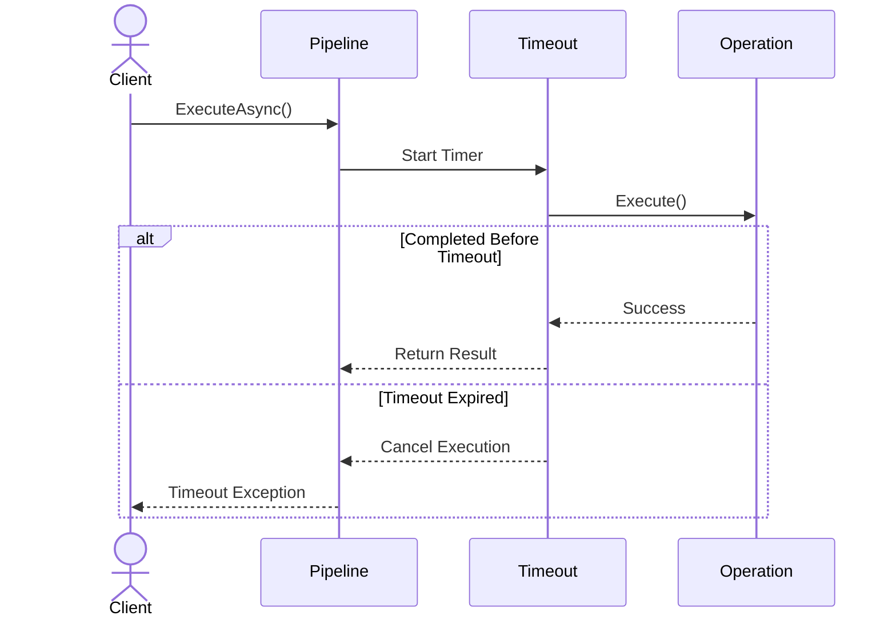

# ⏱️ Timeout Strategy

The **Timeout** strategy limits the maximum execution time of an operation.

If the configured timeout expires before the protected operation completes, the pipeline cancels the execution and throws a timeout exception.

Timeouts help prevent slow or unresponsive dependencies from consuming application resources indefinitely.

---

# Why Use a Timeout?

External dependencies such as databases, Redis, HTTP services, or message brokers may occasionally become slow or stop responding.

Without a timeout, these operations may:

- Block request processing.
- Consume thread pool resources.
- Increase application latency.
- Trigger cascading failures.

A timeout ensures that operations fail fast, allowing the application to recover more quickly.

---

# Basic Configuration

Configure a timeout when building a pipeline.

```csharp
builder.Services.AddResilience(options =>
{
    options.AddPipeline(PipelineType.Redis, pipeline =>
    {
        pipeline.AddTimeout(timeout =>
        {
            timeout.Timeout = TimeSpan.FromSeconds(2);
        });
    });
});
```

In this example, any operation taking longer than two seconds will be cancelled.

---

# Executing an Operation

Resolve the pipeline and execute the protected operation.

```csharp
var pipeline =
    provider.GetPipeline(PipelineType.Redis);

await pipeline.ExecuteAsync(async ct =>
{
    await redis.GetAsync(key, ct);
});
```

If the operation exceeds the configured timeout, execution is interrupted automatically.

---

# Execution Flow



---

# Configuration Options

| Property | Description | Default |
|----------|-------------|---------|
| Enabled | Enables or disables the timeout strategy. | `true` |
| Timeout | Maximum execution time allowed for the operation. | `30 seconds` |

---

# Typical Scenarios

Timeouts are recommended for operations that depend on external systems.

Examples include:

- Redis
- SQL Server
- PostgreSQL
- HTTP APIs
- gRPC services
- Message brokers

---

# Combining Strategies

Timeout is commonly combined with Retry and Circuit Breaker.

```text
Retry

↓

Timeout

↓

Circuit Breaker

↓

Protected Operation
```

A typical execution flow is:

1. Retry handles transient failures.
2. Timeout prevents excessively long executions.
3. Circuit Breaker stops requests when failures become persistent.

---

# Timeout Metrics

When metrics are enabled, timeout events are automatically recorded.

| Metric | Description |
|---------|-------------|
| `core.resilience.timeout.total` | Total number of timeout events. |
| `core.resilience.execution.duration` | Execution duration histogram. |

These metrics can be exported through OpenTelemetry to any compatible monitoring platform.

---

# Best Practices

✅ Configure timeouts according to the expected response time of the dependency.

✅ Prefer shorter timeouts for remote services.

✅ Combine Timeout with Retry for transient failures.

✅ Combine Timeout with Circuit Breaker to prevent cascading failures.

✅ Monitor timeout metrics to detect performance degradation.

---

# Common Pitfalls

Avoid configuring timeouts that are:

### Too Short

Operations may fail before the dependency has enough time to respond.

### Too Long

Slow operations may consume resources unnecessarily and increase latency across the application.

Choose values that reflect the expected response time of each dependency.

---

# Summary

The Timeout strategy prevents operations from running indefinitely by enforcing a maximum execution time.

Combined with Retry and Circuit Breaker, it helps applications remain responsive and resilient when interacting with unreliable external dependencies.