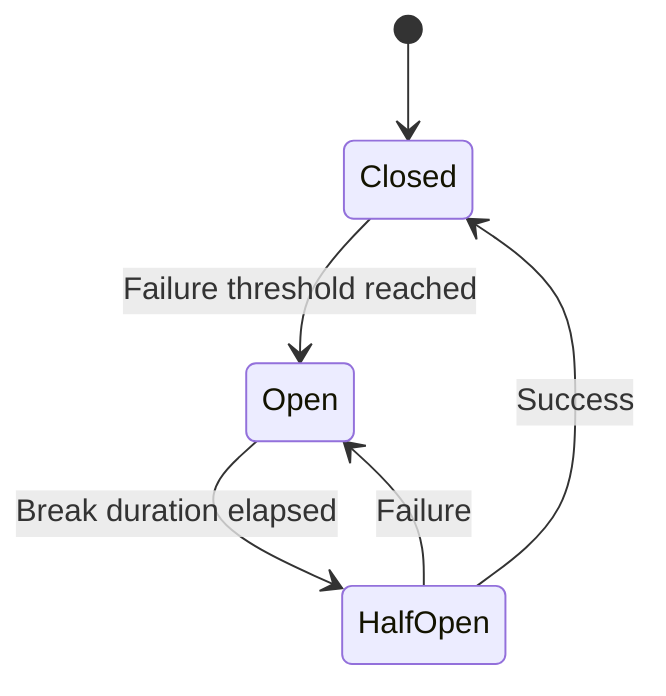
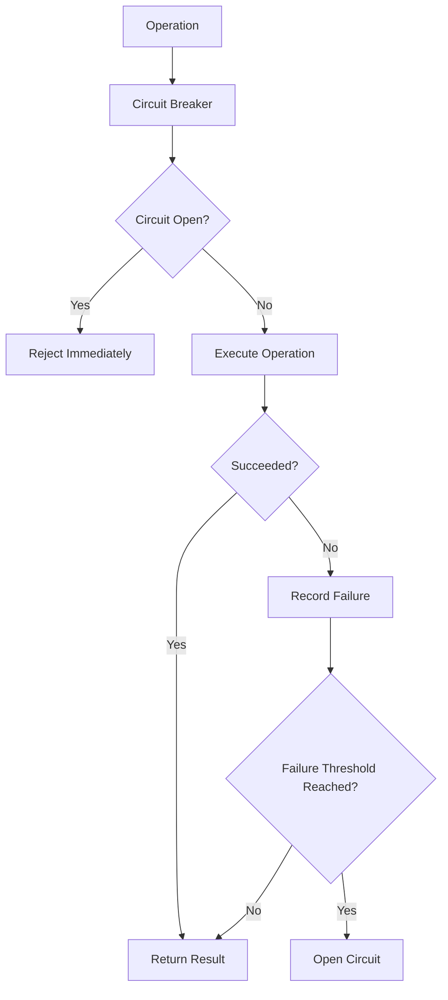

# ⚡ Circuit Breaker

The **Circuit Breaker** strategy protects your application from repeatedly calling unhealthy dependencies.

Instead of continuously attempting operations that are likely to fail, the circuit breaker temporarily blocks new requests, giving the dependency time to recover.

CoreSystem.Resilience provides a simple configuration model while abstracting the underlying resilience implementation.

---

# Why Use a Circuit Breaker?

Transient failures can usually be handled by retries.

However, when a dependency becomes unavailable for an extended period, continuously retrying requests can:

- Increase latency.
- Waste system resources.
- Overload the failing service.
- Delay recovery.

The Circuit Breaker prevents these scenarios by temporarily stopping requests after a configurable failure threshold has been reached.

---

# How It Works

The circuit breaker operates through three states.



---

# Circuit States

## Closed

The circuit is operating normally.

All requests are allowed to execute.

If failures exceed the configured threshold, the circuit transitions to **Open**.

---

## Open

The protected operation is temporarily blocked.

Incoming requests fail immediately without invoking the protected dependency.

This prevents unnecessary load on an already unhealthy service.

---

## Half-Open

After the configured break duration expires, the circuit enters the half-open state.

A limited number of requests are allowed through.

If they succeed, the circuit closes again.

If they fail, the circuit returns to the open state.

---

# Configuring a Circuit Breaker

```csharp
builder.Services.AddResilience(options =>
{
    options.AddPipeline(PipelineType.Redis, pipeline =>
    {
        pipeline.AddCircuitBreaker(cb =>
        {
            cb.Enabled = true;

            cb.FailureRatio = 0.5;

            cb.MinimumThroughput = 10;

            cb.SamplingDuration =
                TimeSpan.FromSeconds(30);

            cb.BreakDuration =
                TimeSpan.FromSeconds(60);
        });
    });
});
```

---

# Configuration Options

| Option | Description | Default |
|----------|-------------|---------|
| Enabled | Enables the strategy | true |
| FailureRatio | Failure percentage required to open the circuit | 0.5 |
| MinimumThroughput | Minimum number of executions before evaluation | 10 |
| SamplingDuration | Evaluation time window | 30 seconds |
| BreakDuration | Time the circuit remains open | 60 seconds |

---

# Execution Flow



---

# Typical Use Cases

The Circuit Breaker is recommended for operations involving external dependencies.

Examples include:

- Redis
- SQL Server
- PostgreSQL
- HTTP APIs
- gRPC services
- Message brokers

---

# Combining with Retry

Retry and Circuit Breaker complement each other.

A typical execution pipeline is:

```text
Retry

↓

Circuit Breaker

↓

Timeout

↓

Protected Operation
```

In this configuration:

- Retry handles transient failures.
- Circuit Breaker protects against prolonged outages.
- Timeout prevents indefinitely waiting operations.

---

# Built-in Metrics

CoreSystem.Resilience automatically records Circuit Breaker metrics.

| Metric | Description |
|---------|-------------|
| `core.resilience.circuitbreaker.opened` | Total number of circuit openings. |
| `core.resilience.circuitbreaker.closed` | Total number of successful recoveries. |
| `core.resilience.circuitbreaker.half_opened` | Total half-open transitions. |

These metrics are published using `System.Diagnostics.Metrics` and are compatible with OpenTelemetry.

---

# Best Practices

✅ Use Circuit Breaker for external dependencies.

✅ Combine with Retry for transient failures.

✅ Configure an appropriate failure ratio.

✅ Avoid very short break durations.

✅ Monitor circuit transitions using OpenTelemetry.

---

# Common Mistakes

❌ Using Circuit Breaker without Retry.

❌ Opening the circuit after too few requests.

❌ Setting an excessively long break duration.

❌ Applying Circuit Breaker to CPU-bound or in-memory operations.

---

# Summary

The Circuit Breaker strategy improves application resilience by preventing repeated calls to unhealthy dependencies.

Combined with Retry and Timeout, it forms a robust execution pipeline capable of handling transient failures while protecting downstream services from overload.