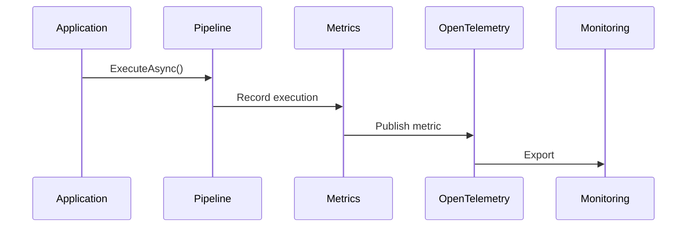

# 📊 Metrics

`CoreSystem.Resilience` includes built-in metrics based on **System.Diagnostics.Metrics**.

Every resilience pipeline automatically records operational metrics that can be consumed by any **OpenTelemetry-compatible** backend, allowing applications to monitor resilience behavior without requiring additional instrumentation.

---

# Why Metrics Matter

Resilience is only effective when it can be measured.

The framework publishes metrics that help answer questions such as:

- How many protected operations are executed?
- How often are retries performed?
- How many operations eventually succeed after retries?
- How many operations fail despite all retry attempts?
- How frequently does the circuit breaker open?
- How many timeout events occur?
- What is the average execution duration of protected operations?

These metrics provide operational visibility while keeping application code clean and focused on business logic.

---

# Architecture


---

# Built-in Metrics

The framework publishes the following metrics.

| Metric | Description |
|----------|-------------|
| `core.resilience.executions` | Total number of protected operations executed. |
| `core.resilience.execution.duration` | Duration of pipeline execution. |
| `core.resilience.retry.attempts` | Total retry attempts performed. |
| `core.resilience.retry.successes` | Operations that eventually succeeded after one or more retries. |
| `core.resilience.retry.failures` | Operations that failed after exhausting all retry attempts. |
| `core.resilience.circuitbreaker.opened` | Number of circuit breaker open events. |
| `core.resilience.circuitbreaker.closed` | Number of circuit breaker closed events. |
| `core.resilience.circuitbreaker.half_opened` | Number of transitions to the half-open state. |
| `core.resilience.timeout.total` | Total timeout events. |
| `core.resilience.failures` | Total failed pipeline executions. |

---

# Registering the Meter

The package automatically creates and publishes its own meter.

Applications only need to register it with OpenTelemetry.

```csharp
builder.Services
    .AddOpenTelemetry()
    .WithMetrics(metrics =>
    {
        metrics.AddMeter("Core.Resilience");

        metrics.AddPrometheusExporter();
    });
```

---

# Compatible Platforms

The metrics can be exported to any OpenTelemetry-compatible backend.

| Platform | Supported |
|-----------|:---------:|
| Prometheus | ✅ |
| Grafana | ✅ |
| Azure Monitor | ✅ |
| OTLP | ✅ |
| Datadog | ✅ |
| Elastic | ✅ |

---

# Example Dashboard

Typical dashboards include:

- Total pipeline executions
- Average execution duration
- Retry attempts
- Retry success rate
- Retry failure rate
- Circuit breaker state transitions
- Timeout events
- Failed operations

*(Grafana dashboard examples can be added here in future releases.)*

---

# Metric Lifecycle



---

# Observability Integration

The framework emits metrics using the standard .NET metrics APIs.

This makes `CoreSystem.Resilience` compatible with the existing OpenTelemetry ecosystem without requiring vendor-specific integrations.

Applications can combine these metrics with logs and traces to obtain a complete view of service reliability.

---

# Best Practices

✅ Monitor retry frequency.

✅ Alert when retry failures increase.

✅ Track circuit breaker open events.

✅ Investigate frequent timeout events.

✅ Monitor execution duration trends.

✅ Export metrics through OTLP.

---

# Operational Recommendations

### Healthy

Typical indicators:

- Low retry rate
- Few timeout events
- Circuit breaker remains closed
- Stable execution duration

No action is required.

---

### Warning

Typical indicators:

- Increasing retry attempts
- Frequent timeout events
- Longer execution times

Recommended actions:

- Review dependency latency.
- Verify network connectivity.
- Inspect downstream service performance.

---

### Critical

Typical indicators:

- High retry failure rate
- Circuit breaker repeatedly opening
- Persistent timeout events

Recommended actions:

- Investigate the affected dependency.
- Review resilience configuration.
- Validate timeout values.
- Scale or restore the downstream service.

---

# Future Metrics

Future releases may introduce additional metrics such as:

- Retry delay duration
- Pipeline throughput
- Concurrent executions
- Strategy-specific execution time
- Custom metric enrichment
- Pipeline success rate

These additions will remain backward compatible with existing telemetry.