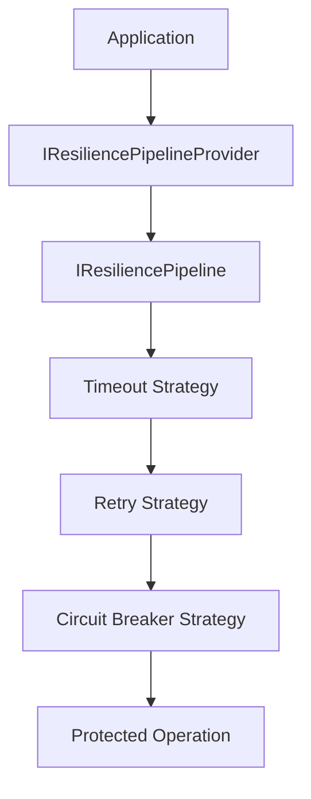
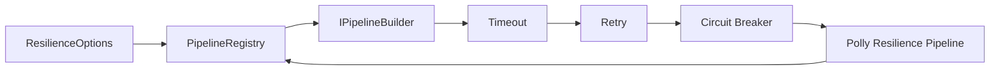
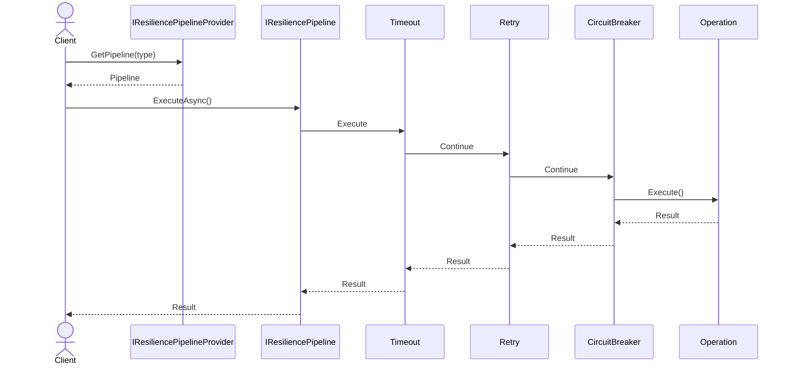
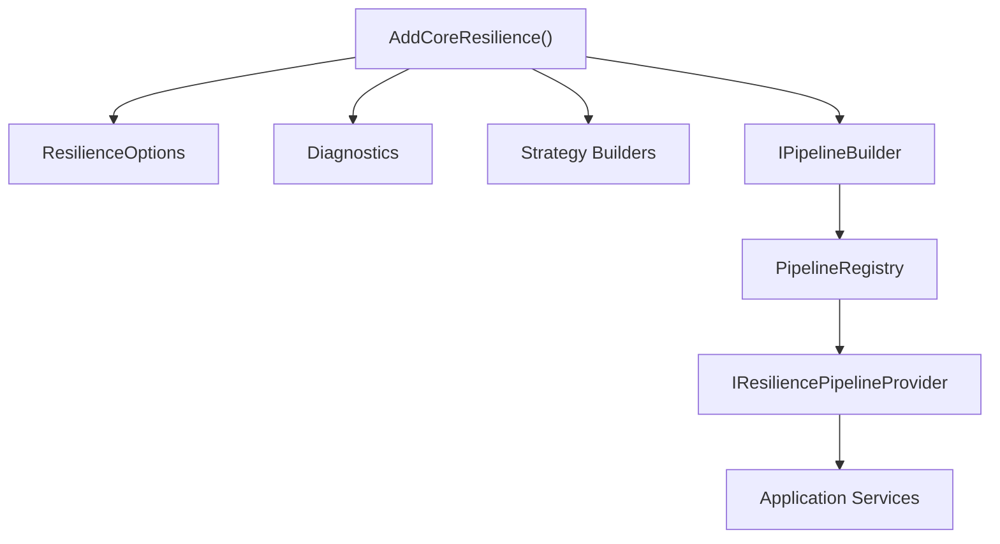
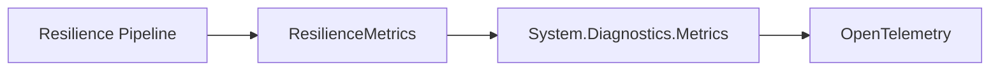

# 🏗️ Architecture

`CoreSystem.Resilience` is built around the concept of **configured resilience pipelines**.

Rather than coupling resilience strategies directly to application code, every protected operation is executed through an `IResiliencePipeline`. Each pipeline can contain one or more configured resilience strategies, allowing resilience concerns to remain isolated from business logic.

The framework provides an abstraction over Polly through `IResiliencePipeline`, while the internal implementation uses Polly to build and execute the configured pipeline.

---

# Architectural Overview

Applications interact with the public abstractions exposed by the framework.

The `IResiliencePipelineProvider` resolves a configured pipeline by its `PipelineType`. The resolved `IResiliencePipeline` executes the operation through the strategies configured for that pipeline.

The strategy order is defined internally by the framework:

1. Timeout
2. Retry
3. Circuit Breaker

Only strategies configured for the selected pipeline are added.

---

# Design Goals

The framework is designed around a few core principles.

* Keep business code independent from the underlying resilience implementation.
* Hide Polly behind the `IResiliencePipeline` abstraction.
* Support multiple configured pipelines identified by `PipelineType`.
* Allow resilience strategies to be configured independently.
* Integrate naturally with Dependency Injection.
* Publish operational metrics using `System.Diagnostics.Metrics`.

---

# Architectural Patterns

`CoreSystem.Resilience` uses several components with clear responsibilities.

| Component              | Purpose                                                    |
| ---------------------- | ---------------------------------------------------------- |
| **PipelineBuilder**    | Builds a Polly resilience pipeline from `PipelineOptions`. |
| **PipelineRegistry**   | Creates and stores configured pipelines.                   |
| **Provider**           | Resolves pipelines by `PipelineType`.                      |
| **Strategy Builders**  | Configure Retry, Timeout, and Circuit Breaker strategies.  |
| **ResiliencePipeline** | Adapts the Polly pipeline to `IResiliencePipeline`.        |
| **ResilienceMetrics**  | Records the metrics implemented by the framework.          |

The framework registers these components through the standard .NET Dependency Injection container.

---

# Core Components

The framework exposes a small set of public abstractions while keeping the concrete implementation internal.

| Component                       | Responsibility                                                             |
| ------------------------------- | -------------------------------------------------------------------------- |
| **IResiliencePipeline**         | Executes asynchronous operations through a configured resilience pipeline. |
| **IResiliencePipelineProvider** | Resolves a pipeline by `PipelineType`.                                     |
| **IPipelineBuilder**            | Defines the contract for building a resilience pipeline.                   |
| **PipelineBuilder**             | Builds the internal Polly pipeline from the configured strategies.         |
| **PipelineRegistry**            | Stores the pipelines created from `ResilienceOptions`.                     |
| **ResiliencePipeline**          | Provides the public abstraction over the Polly pipeline.                   |

The available `PipelineType` values provided by the core are:

* `Default`
* `Redis`
* `Sql`
* `Http`
* `Messaging`

---

# Pipeline Construction

During service registration, the configured `ResilienceOptions` are registered together with the pipeline infrastructure.

The `PipelineRegistry` creates a pipeline for every entry in `ResilienceOptions.Pipelines`.

`PipelineBuilder` orders the registered strategy builders by their configured order before building the Polly pipeline.

The resulting pipelines are stored in the registry and reused when requested through the provider.

---

# Execution Lifecycle

Every protected operation follows the same execution flow.

The application resolves a pipeline and executes an operation through `IResiliencePipeline`.

The pipeline supports both operations that return no result and operations that return a value.

---

# Dependency Injection

The framework integrates with the standard .NET Dependency Injection container.

When resilience is enabled, the framework registers the pipeline infrastructure, diagnostics, and the three implemented strategy builders.

When `ResilienceOptions.Enabled` is `false`, the framework registers a `NoOpResiliencePipelineProvider`. This provider returns a no-op pipeline that executes the supplied operation without applying resilience strategies.

---

# Metrics Flow

The framework records the metrics implemented by `ResilienceMetrics` using `System.Diagnostics.Metrics`.

The implemented metrics cover:

* Retry attempts.
* Timeout events.
* Circuit breaker state transitions.
* Pipeline execution duration.

The framework registers its `Core.Resilience` meter through its observability contributor.

---

# Design Principles

When working with the framework, follow these principles.

* Keep resilience configuration separate from business logic.
* Use the appropriate `PipelineType` for each workload.
* Configure only the strategies required by the pipeline.
* Pass and observe cancellation tokens when executing operations.
* Prefer the public abstractions over the internal implementation.
* Keep strategy behavior isolated from application code.

---

# Summary

`CoreSystem.Resilience` provides a modular pipeline architecture for executing protected operations through configurable resilience strategies.

The core builds Polly pipelines from `ResilienceOptions`, registers them in a pipeline registry, and exposes them through `IResiliencePipelineProvider`.

The current implementation includes **Timeout, Retry, and Circuit Breaker** strategies, executed in that order, together with Dependency Injection and built-in metrics for retry attempts, timeouts, circuit state transitions, and execution duration.
