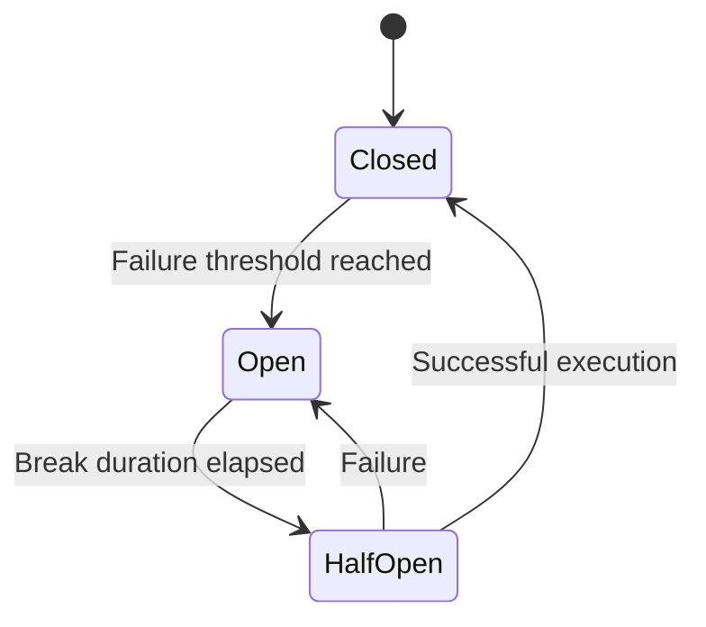
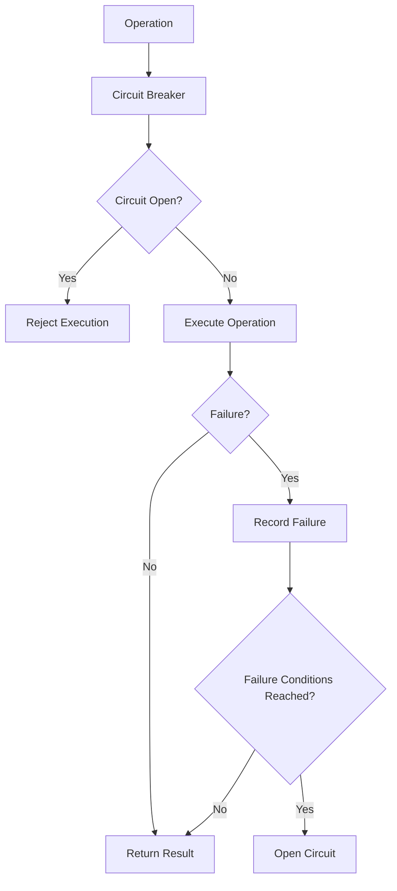

# ⚡ Circuit Breaker

The **Circuit Breaker** strategy protects your application from repeatedly executing operations against an unhealthy dependency.

When the configured failure conditions are reached, the circuit opens and prevents new executions until the configured break duration has elapsed.

CoreSystem.Resilience provides configuration for the circuit breaker while using Polly internally to execute the strategy.

---

# Why Use a Circuit Breaker?

When a dependency repeatedly fails, continuing to execute operations can increase failures and resource consumption.

The Circuit Breaker can temporarily stop executions after the configured failure threshold is reached.

This helps:

* Reduce repeated calls to an unhealthy dependency.
* Fail fast while the circuit is open.
* Allow the dependency time to recover.
* Prevent unnecessary resource consumption.

---

# How It Works

The circuit breaker uses three states.



---

# Circuit States

## Closed

The circuit operates normally and allows executions.

Failures are evaluated according to the configured `FailureRatio`, `MinimumThroughput`, and `SamplingDuration`.

When the configured failure conditions are reached, the circuit transitions to **Open**.

---

## Open

The circuit prevents executions from reaching the protected operation.

After the configured `BreakDuration` has elapsed, the circuit can transition to **Half-Open**.

---

## Half-Open

The circuit allows an execution to determine whether the dependency has recovered.

If the execution succeeds, the circuit transitions to **Closed**.

If it fails according to the configured exception handling rules, the circuit can return to **Open**.

---

# Configuring a Circuit Breaker

```csharp
builder.Services.AddCoreResilience(options =>
{
    options.AddPipeline(PipelineType.Redis, pipeline =>
    {
        pipeline.CircuitBreaker = new CircuitBreakerOptions
        {
            Enabled = true,
            FailureRatio = 0.5,
            MinimumThroughput = 10,
            SamplingDuration = TimeSpan.FromSeconds(30),
            BreakDuration = TimeSpan.FromSeconds(15)
        };
    });
});
```

The circuit breaker is only added when `CircuitBreakerOptions.Enabled` is `true`.

---

# Configuration Options

| Option                 | Description                                                              | Default      |
| ---------------------- | ------------------------------------------------------------------------ | ------------ |
| Enabled                | Enables or disables the circuit breaker strategy.                        | `true`       |
| FailureRatio           | Failure ratio required to open the circuit.                              | `0.5`        |
| MinimumThroughput      | Minimum number of executions before the failure ratio is evaluated.      | `10`         |
| SamplingDuration       | Duration of the evaluation window.                                       | `30 seconds` |
| BreakDuration          | Duration the circuit remains open before transitioning toward half-open. | `15 seconds` |
| IncludeInnerExceptions | Inspects inner exceptions when matching handled exception types.         | `false`      |

---

# Execution Flow



---

# Handling Exceptions

The Circuit Breaker can be configured with specific exception types.

```csharp
pipeline.CircuitBreaker = new CircuitBreakerOptions()
    .Handle<HttpRequestException>();
```

Multiple exception types can also be configured.

```csharp
pipeline.CircuitBreaker = new CircuitBreakerOptions()
    .Handle(
        typeof<HttpRequestException>(),
        typeof(TimeoutException));
```

Only the configured exception types are considered by the Circuit Breaker.

---

## Matching Inner Exceptions

By default, exception matching only considers the exception being evaluated.

Set `IncludeInnerExceptions` to `true` when the handled exception may be wrapped by another exception.

```csharp
pipeline.CircuitBreaker = new CircuitBreakerOptions
{
    IncludeInnerExceptions = true
}
.Handle<TimeoutException>();
```

With this option enabled, the framework searches the exception chain and also handles matching exceptions contained in an `AggregateException`.

---

# Built-in Metrics

CoreSystem.Resilience records Circuit Breaker state transitions through `System.Diagnostics.Metrics`.

| Metric                                | Description                                   |
| ------------------------------------- | --------------------------------------------- |
| `core.resilience.circuit.opened`      | Number of transitions to the Open state.      |
| `core.resilience.circuit.closed`      | Number of transitions to the Closed state.    |
| `core.resilience.circuit.half_opened` | Number of transitions to the Half-Open state. |

These metrics are recorded by the internal `ResilienceMetrics` component.

---

# Combining with Other Strategies

The framework builds configured strategies in the following order:

```text
Timeout

↓

Retry

↓

Circuit Breaker

↓

Protected Operation
```

This order is defined by the internal strategy ordering used by `PipelineBuilder`.

The Circuit Breaker can therefore be combined with Retry and Timeout when all three strategies are configured for the same pipeline.

---

# Best Practices

✅ Configure the failure ratio according to the expected behavior of the dependency.

✅ Use an appropriate `MinimumThroughput` before evaluating failures.

✅ Choose a `BreakDuration` that gives the dependency an opportunity to recover.

✅ Configure handled exceptions explicitly when the default behavior is not sufficient.

✅ Use `IncludeInnerExceptions` when exceptions are wrapped by other components.

---

# Summary

The Circuit Breaker strategy prevents repeated executions when a configured failure threshold is reached.

CoreSystem.Resilience configures the strategy through `CircuitBreakerOptions` and records Open, Closed, and Half-Open state transitions through its built-in metrics.

When combined with **Timeout** and **Retry**, the strategies are applied in the framework's configured order: **Timeout → Retry → Circuit Breaker**.
