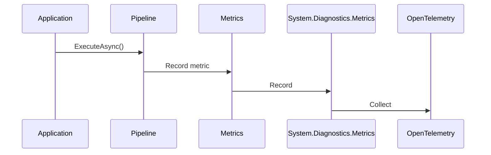

# 📊 Metrics

`CoreSystem.Resilience` includes built-in metrics based on **System.Diagnostics.Metrics**.

The framework records resilience-related metrics through `ResilienceMetrics`, allowing the metrics to be consumed through the application's OpenTelemetry configuration.

---

# Why Metrics Matter

Resilience behavior can be monitored through metrics that provide visibility into the execution of configured strategies.

The current implementation records:

* Retry attempts.
* Timeout events.
* Circuit breaker state transitions.
* Pipeline execution duration.

These metrics are recorded by the resilience strategies and the pipeline execution infrastructure.

---

# Architecture


The framework creates a meter named `Core.Resilience` and registers it through the observability contributor.

---

# Built-in Metrics

The framework currently publishes the following metrics.

| Metric                                | Description                                                                            |
| ------------------------------------- | -------------------------------------------------------------------------------------- |
| `core.resilience.pipeline.duration`   | Execution time of the resilience pipeline, including configured resilience strategies. |
| `core.resilience.retry.attempts`      | Total number of retry attempts executed by the retry strategy.                         |
| `core.resilience.timeout.triggered`   | Total number of operations that exceeded the configured timeout.                       |
| `core.resilience.circuit.opened`      | Total number of times the circuit breaker transitioned to the Open state.              |
| `core.resilience.circuit.half_opened` | Total number of times the circuit breaker transitioned to the Half-Open state.         |
| `core.resilience.circuit.closed`      | Total number of times the circuit breaker transitioned to the Closed state.            |

The execution duration metric is recorded as a histogram in milliseconds.

Retry and timeout metrics are counters. Circuit breaker state transition metrics are also recorded as counters.

---

# Registering the Meter

The framework registers its meter through `ResilienceObservabilityContributor`.

The contributor configures OpenTelemetry metrics with the meter:

```csharp
builder.Services
    .AddOpenTelemetry()
    .WithMetrics(metrics =>
    {
        metrics.AddMeter("Core.Resilience");
    });
```

The framework does not configure a specific exporter. Exporter configuration remains part of the application's OpenTelemetry setup.

---

# Metric Tags

Some metrics include tags when they are recorded.

For example, retry attempts include:

```text
strategy = retry
attempt = <attempt number>
```

Timeout events include:

```text
strategy = timeout
```

Pipeline execution duration can also receive tags from the execution pipeline.

The exact tags available depend on the metric being recorded.

---

# Metric Lifecycle



Metrics are recorded while the configured resilience pipeline executes.

Retry records an attempt whenever the retry callback is invoked.

Timeout records an event when the configured timeout is triggered.

Circuit Breaker records state transition events when the circuit opens, closes, or becomes half-open.

Execution duration is recorded for the pipeline execution.

---

# Observability Integration

The framework uses the standard .NET metrics API through `System.Diagnostics.Metrics`.

The meter name is:

```text
Core.Resilience
```

The diagnostic source name exposed by the observability contributor is also:

```text
Core.Resilience
```

The current implementation registers the meter with OpenTelemetry metrics.

The provided code does not configure a specific monitoring backend or exporter.

---

# Operational Recommendations

### Retry

Monitor retry attempts to identify dependencies that are experiencing transient failures.

### Timeout

Monitor timeout events to identify operations exceeding their configured execution time.

### Circuit Breaker

Monitor circuit state transitions to identify dependencies that are repeatedly failing.

### Execution Duration

Monitor pipeline execution duration to identify changes in the time required to complete protected operations.

---

# Future Metrics

Additional metrics may be introduced in future versions.

The current implementation does not provide metrics for:

* Total pipeline executions.
* Pipeline failures.
* Retry successes.
* Retry failures.
* Retry delay duration.
* Pipeline throughput.
* Concurrent executions.
* Pipeline success rate.

These should not be considered implemented capabilities of the current version.
