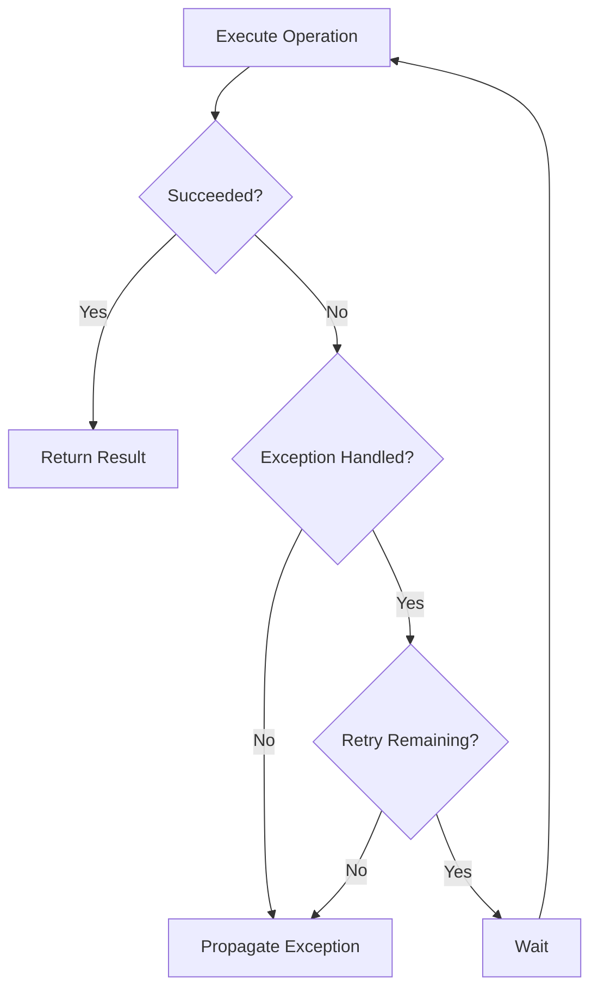

# 🔁 Retry Strategy

The **Retry** strategy automatically retries failed operations when the configured exceptions occur.

Transient failures are temporary issues that may recover after a short delay. Retry gives the operation additional opportunities to succeed before the failure is propagated to the caller.

---

# Why Retry?

Operations that communicate with external dependencies can occasionally fail because of temporary conditions.

Examples include:

* Network interruptions
* Connection resets
* Temporary service unavailability
* Short-lived infrastructure failures

Retry can help applications recover from these failures without requiring retry logic to be implemented directly in business code.

---

# Basic Configuration

Configure Retry when building a resilience pipeline.

```csharp
builder.Services.AddCoreResilience(options =>
{
    options.AddPipeline(PipelineType.Redis, pipeline =>
    {
        pipeline.Retry = new RetryOptions
        {
            MaxRetryAttempts = 3
        };
    });
});
```

In this example, the operation can be executed up to **three additional times** when a configured exception is handled by the Retry strategy.

---

# Configuration Options

| Option                 | Description                                                 | Default        |
| ---------------------- | ----------------------------------------------------------- | -------------- |
| Enabled                | Enables or disables the strategy.                           | `true`         |
| MaxRetryAttempts       | Maximum number of retry attempts.                           | `3`            |
| Delay                  | Initial delay between retries.                              | `00:00:00.200` |
| BackoffType            | Delay calculation strategy.                                 | Exponential    |
| UseJitter              | Adds randomization to retry delays.                         | `false`        |
| IncludeInnerExceptions | Inspects inner exceptions when matching handled exceptions. | `false`        |

---

# Delay Strategies

Retry supports multiple backoff algorithms.

## Constant

Uses the same delay between retry attempts.

```text
Attempt 1 → 200ms

Attempt 2 → 200ms

Attempt 3 → 200ms
```

Configure:

```csharp
retry.BackoffType = BackoffType.Constant;
```

---

## Linear

The delay increases linearly between retry attempts.

```text
Attempt 1 → delay

Attempt 2 → increased delay

Attempt 3 → further increased delay
```

Configure:

```csharp
retry.BackoffType = BackoffType.Linear;
```

---

## Exponential

The delay increases exponentially between retry attempts.

```text
Attempt 1 → delay

Attempt 2 → increased delay

Attempt 3 → further increased delay
```

Configure:

```csharp
retry.BackoffType = BackoffType.Exponential;
```

This is the default backoff type.

---

# Jitter

Retry supports jitter through the `UseJitter` option.

```csharp
retry.UseJitter = true;
```

When enabled, Polly applies jitter to the configured retry delays.

The default value in CoreSystem.Resilience is `false`.

---

# Handling Exceptions

By default, Retry does not add custom handled exceptions to the strategy.

Applications can configure the exception types that should trigger retries.

```csharp
pipeline.Retry = new RetryOptions
{
    MaxRetryAttempts = 3
}
.Handle<TimeoutException>()
.Handle<HttpRequestException>();
```

Multiple exception types can also be configured.

```csharp
pipeline.Retry = new RetryOptions
{
    MaxRetryAttempts = 3
}
.Handle(
    typeof(SocketException),
    typeof(IOException));
```

Only configured exception types are considered by the custom Retry predicate.

---

# Matching Inner Exceptions

Some operations may throw an exception that contains the actual transient exception as an inner exception.

Enable `IncludeInnerExceptions` to inspect the exception chain.

```csharp
pipeline.Retry = new RetryOptions
{
    MaxRetryAttempts = 3,
    IncludeInnerExceptions = true
}
.Handle<TimeoutException>();
```

The matcher checks nested inner exceptions and also handles exceptions contained inside an `AggregateException`.

For example:

```text
InvalidOperationException
└── HttpRequestException
    └── TimeoutException
```

If `IncludeInnerExceptions` is enabled and `TimeoutException` is configured, the Retry strategy can handle the exception.

When it is disabled, only the exception directly evaluated by the Retry predicate is considered.

---

# Execution Flow



The Retry strategy is configured as the second strategy in the CoreSystem.Resilience pipeline.

The current strategy order is:

```text
Timeout

↓

Retry

↓

Circuit Breaker

↓

Protected Operation
```

---

# Metrics

Retry records the number of retry attempts using `System.Diagnostics.Metrics`.

| Metric                           | Description                                                    |
| -------------------------------- | -------------------------------------------------------------- |
| `core.resilience.retry.attempts` | Total number of retry attempts executed by the Retry strategy. |

The metric is recorded each time the Retry strategy performs a retry.

---

# Best Practices

✅ Retry only exceptions that are appropriate for retry.

✅ Keep the number of retry attempts reasonable.

✅ Use exponential backoff when appropriate.

✅ Consider enabling jitter when multiple clients may retry simultaneously.

✅ Use `IncludeInnerExceptions` when wrapped exceptions need to be matched.

✅ Combine Retry with Timeout and Circuit Breaker when the workload requires multiple resilience controls.

---

# Common Scenarios

Retry can be useful for operations involving potentially transient failures, such as:

* Redis operations
* HTTP requests
* Database operations
* Cloud services
* Message brokers

Retry should not automatically be applied to every exception. Validation errors, authentication failures, authorization failures, and business rule violations should only be retried when the application's specific behavior requires it.

---

# Summary

The Retry strategy provides configurable retries for selected exception types.

CoreSystem.Resilience supports:

* Configurable retry attempts.
* Constant, linear, and exponential backoff.
* Optional jitter.
* Custom handled exception types.
* Optional matching of nested and aggregate exceptions.
* Retry attempt metrics.

Retry is executed after Timeout and before Circuit Breaker in the current resilience pipeline.