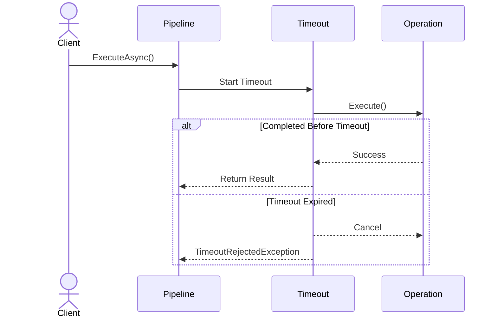

# ⏱️ Timeout Strategy

The **Timeout** strategy limits the maximum execution time of an operation.

If the configured timeout expires before the protected operation completes, the pipeline cancels the execution and Polly throws a `TimeoutRejectedException`.

Timeouts help prevent slow or unresponsive dependencies from consuming application resources indefinitely.

---

# Why Use a Timeout?

External dependencies such as databases, Redis, HTTP services, or message brokers may occasionally become slow or stop responding.

Without a timeout, these operations may:

* Block request processing.
* Consume application resources.
* Increase application latency.
* Contribute to cascading failures.

A timeout ensures that operations do not continue indefinitely when the configured execution time is exceeded.

---

# Basic Configuration

Configure a timeout when building a pipeline.

```csharp
builder.Services.AddCoreResilience(options =>
{
    options.AddPipeline(PipelineType.Redis, pipeline =>
    {
        pipeline.Timeout = new TimeoutOptions
        {
            Timeout = TimeSpan.FromSeconds(2)
        };
    });
});
```

In this example, operations that exceed two seconds are cancelled by the timeout strategy.

---

# Executing an Operation

Resolve the pipeline and execute the protected operation.

```csharp
var pipeline =
    provider.GetPipeline(PipelineType.Redis);

await pipeline.ExecuteAsync(async cancellationToken =>
{
    await redis.GetAsync(key, cancellationToken);
});
```

The operation receives the cancellation token supplied by the resilience pipeline and should observe it so that timeout cancellation can stop the operation.

---

# Execution Flow



---

# Configuration Options

| Property | Description                                       | Default      |
| -------- | ------------------------------------------------- | ------------ |
| Timeout  | Maximum execution time allowed for the operation. | `30 seconds` |

The timeout must be greater than zero. Assigning a zero or negative value throws an `ArgumentOutOfRangeException`.

---

# Typical Scenarios

Timeouts can be used for operations that depend on external systems.

Examples include:

* Redis
* SQL Server
* PostgreSQL
* HTTP APIs
* gRPC services
* Message brokers

The specific dependency integration is outside the scope of this package.

---

# Combining Strategies

Timeout can be combined with Retry and Circuit Breaker.

The current framework builds the strategies in this order:

```text
Timeout

↓

Retry

↓

Circuit Breaker

↓

Protected Operation
```

This order is defined by the internal strategy ordering used when the pipeline is built.

---

# Timeout Metrics

The framework defines a metric for timeout events.

| Metric                              | Description                                                      |
| ----------------------------------- | ---------------------------------------------------------------- |
| `core.resilience.timeout.triggered` | Total number of operations that exceeded the configured timeout. |

The metric is recorded when the timeout callback is triggered and is published through the `Core.Resilience` meter.

The framework also defines a pipeline execution duration histogram:

| Metric                              | Description                                |
| ----------------------------------- | ------------------------------------------ |
| `core.resilience.pipeline.duration` | Execution time of the resilience pipeline. |

---

# Best Practices

✅ Configure timeouts according to the expected execution time of the operation.

✅ Ensure protected operations observe the provided cancellation token.

✅ Avoid timeout values that are unnecessarily short.

✅ Avoid timeout values that allow operations to run indefinitely.

✅ Combine Timeout with other resilience strategies when required by the workload.

---

# Common Pitfalls

Avoid configuring timeouts that are:

### Too Short

Operations may be cancelled before they have enough time to complete.

### Too Long

Slow operations may continue consuming resources and increase application latency.

Choose a timeout value appropriate for the operation being protected.

---

# Summary

The Timeout strategy prevents protected operations from running longer than the configured duration.

`TimeoutOptions` uses a default timeout of **30 seconds** and requires a value greater than zero.

When the timeout is exceeded, the operation receives cancellation and the pipeline reports a `TimeoutRejectedException`.

Timeout can be combined with Retry and Circuit Breaker as part of a configured resilience pipeline.
