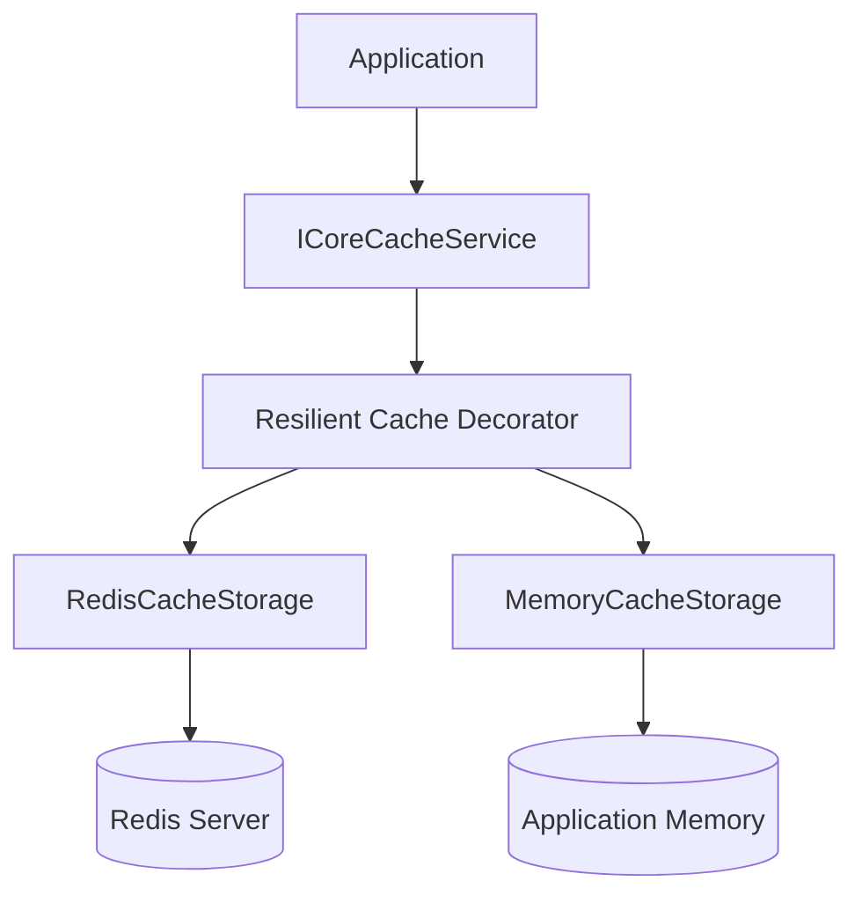
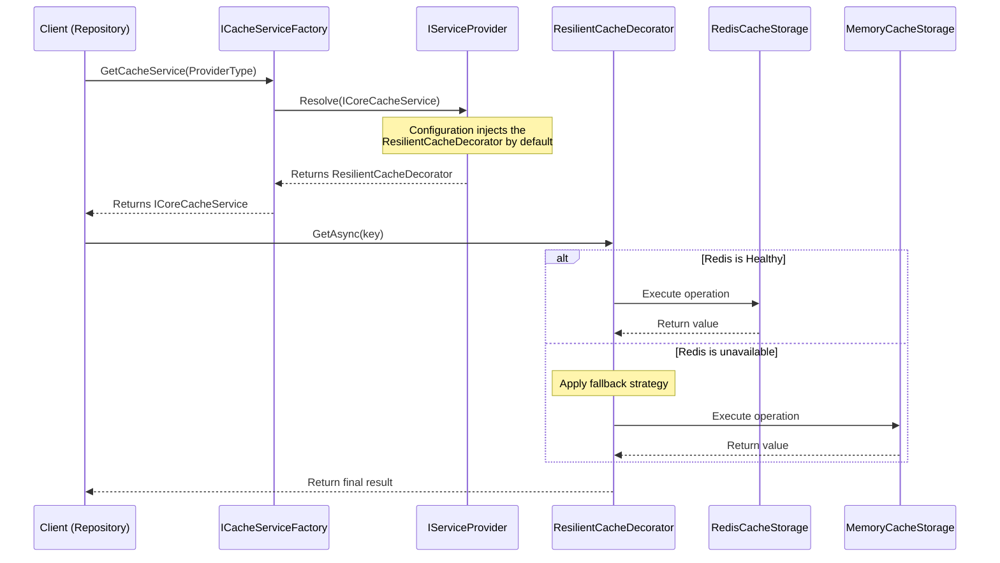
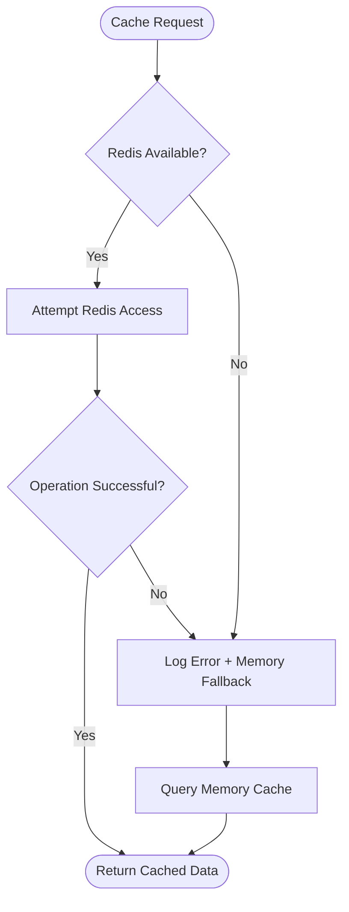
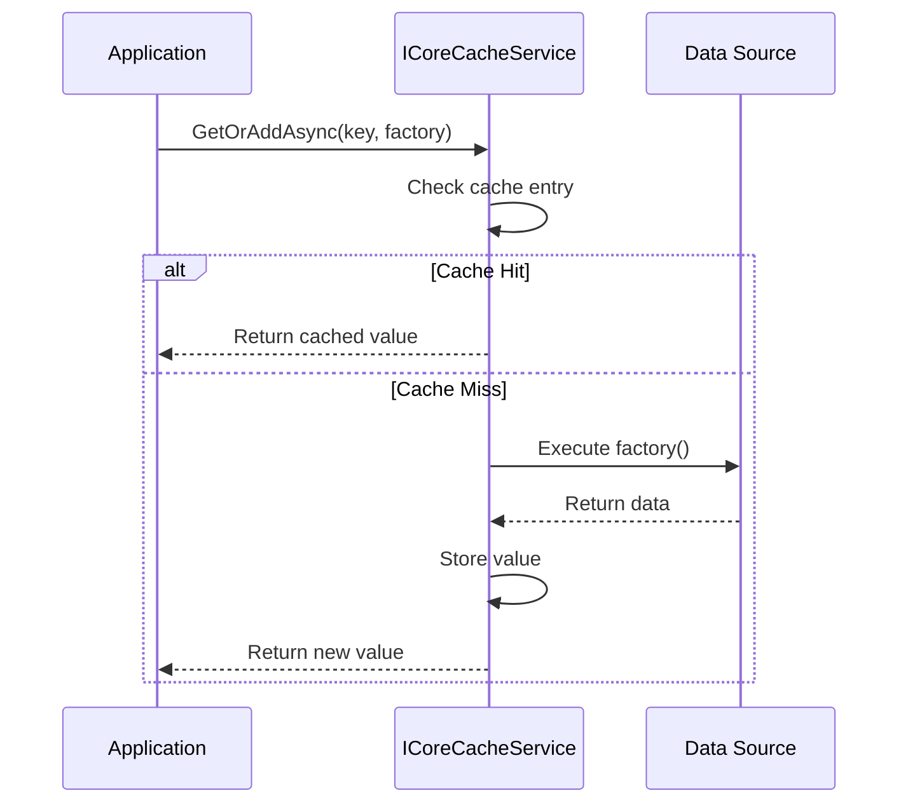
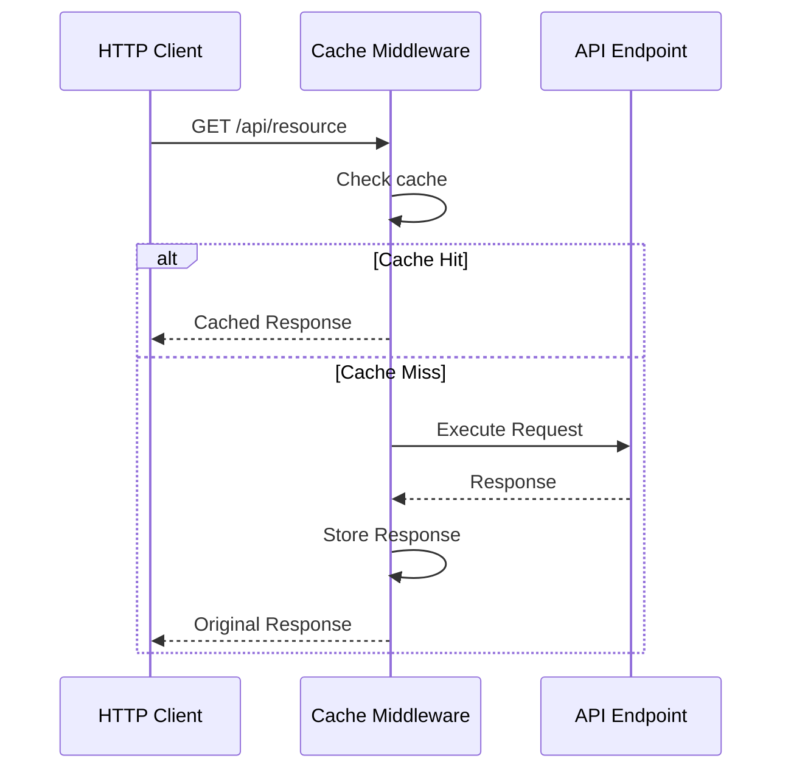

# ⚡ FGutierrez.Core.DistributedCache


---

# 🚀 Overview

**FGutierrez.Core.DistributedCache** is a high-performance distributed caching library for **.NET 8** designed to provide a unified abstraction over multiple cache providers.

The library simplifies cache integration by providing:

* In-memory caching
* Redis distributed caching
* Automatic resilience and fallback strategies
* HTTP response caching middleware
* OpenTelemetry metrics
* Health checks
* Provider-based extensibility
* Declarative method-level caching

Built following **cloud-native architecture principles**, applications can consume caching capabilities without being coupled to a specific infrastructure provider.

---

# ✨ Features

| Feature                 | Description                                              |
| ----------------------- | -------------------------------------------------------- |
| 🧩 Unified API          | Single abstraction over multiple cache providers         |
| ⚡ High Performance      | Optimized cache access patterns                          |
| 🔄 Resilience           | Automatic fallback when distributed cache is unavailable |
| 🧠 Cache Aside Pattern  | Built-in `GetOrAddAsync` workflow                        |
| 🌐 HTTP Middleware      | API response caching support                             |
| 📊 Observability        | OpenTelemetry metrics integration                        |
| 🩺 Health Checks        | Provider availability monitoring                         |
| 🏷️ Declarative Caching | Attribute-based caching using `[Cacheable]`              |

---

# 🏗️ Architecture

The library follows a provider-based architecture where the application consumes a single abstraction while the infrastructure layer decides the cache implementation.



---

# 🏭 Cache Provider Factory

When an application requires explicit provider selection, the library exposes `ICacheServiceFactory`.



---

# 🛡️ Resilience Strategy

The default implementation uses a resilient decorator that automatically falls back to memory cache when Redis becomes unavailable.



---

# ⚡ Cache Aside Pattern

The library provides a built-in `GetOrAddAsync` workflow.



---

# 🌐 HTTP Cache Middleware

Provides transparent response caching capabilities for API endpoints.



---

# 📦 Installation

Install the package using NuGet:

```bash
dotnet add package FGutierrez.Core.DistributedCache
```

---

# ⚙️ Configuration

## appsettings.json

```json
{
  "DistributedCache": {
    "Provider": "Redis",
    "InstanceName": "MySystem",
    "Redis": {
      "Enabled": true,
      "Host": "localhost:6379",
      "Password": "your-password"
    }
  }
}
```

---

## Redis Setup

```csharp
var builder = WebApplication.CreateBuilder(args);

var distributedCache = config.GetSection("DistributedCache");

if (distributedCache.Exists())
{
    builder.Services.AddCoreDistributedCache(options =>
    {
        distributedCache.Bind(options);

        if (options.Redis.Enabled)
        {
            var redisSection =
                config.GetSection("DistributedCache:Redis");

            var host =
                redisSection["Host"] ?? "localhost:6379";

            var password =
                redisSection["Password"];

            options.Redis.Configuration = redisConfig =>
            {
                redisConfig.EndPoints.Add(host);

                if (!string.IsNullOrEmpty(password))
                {
                    redisConfig.Password = password;
                }

                redisConfig.AbortOnConnectFail = false;
            };
        }
    });
}

var app = builder.Build();
app.UseCoreDistributedCache();
app.Run();
```

---

# 🧑‍💻 Basic Usage

Inject `ICoreCacheService` into your services.

```csharp
public class ProductService
{
    private readonly ICoreCacheService _cache;

    public ProductService(ICoreCacheService cache)
    {
        _cache = cache;
    }

    public async Task<Product> GetAsync(Guid id)
    {
        return await _cache.GetOrAddAsync(
            $"product:{id}",
            async () =>
            {
                return await LoadFromDatabase(id);
            });
    }
}
```

---

# 🎯 Advanced Usage: Provider Selection

```csharp
public class MyBusinessService(ICacheServiceFactory cacheFactory)
{
    public async Task SaveAsync(bool forceRedis)
    {
        var provider =
            forceRedis
            ? CacheProviderType.Redis
            : CacheProviderType.Memory;

        var cache =
            cacheFactory.GetCache(provider);

        await cache.SetAsync(
            "my_key",
            myData,
            TimeSpan.FromMinutes(5));
    }


    public async Task DefaultAsync()
    {
        var cache =
            cacheFactory.GetDefaultCache();

        await cache.GetOrAddAsync(
            "default_key",
            async () => GetData());
    }
}
```

---

# 🏷️ Declarative Caching

Caching logic can be applied declaratively using the `[Cacheable]` attribute.

This removes repetitive cache handling code from business services.

Example:

```csharp
[HttpGet("data/{id}")]
[Cacheable(
    tag: "Order",
    expirationSeconds: 300)]
public async Task<IActionResult> GetData(string id)
{
    var result =
        await myService.GetDataAsync(id);

    return Ok(result);
}
```

---

# 📊 Observability

The library integrates with **OpenTelemetry Metrics**.

| Metric                        | Description                    |
| ----------------------------- | ------------------------------ |
| `cache.distributed.hits`      | Successful cache retrievals    |
| `cache.distributed.misses`    | Cache lookup misses            |
| `cache.distributed.errors`    | Provider errors                |
| `cache.distributed.fallbacks` | Resilience fallback executions |

Compatible with:

* Grafana
* Prometheus
* Jaeger
* Azure Monitor
* Elastic Observability
* Any OTLP-compatible backend

---

# 🩺 Health Checks

The package integrates with:

```csharp
builder.Services.AddHealthChecks();
```

Provides monitoring for:

* Redis availability
* Memory cache status
* Provider connectivity

---

# 🛠️ Requirements

* .NET 8 SDK
* Microsoft.Extensions.Caching.Memory
* StackExchange.Redis
* OpenTelemetry
* Microsoft.Extensions.Diagnostics.HealthChecks

---

# 🏗️ Design Principles

FGutierrez.Core.DistributedCache follows:

* Clean Architecture principles
* Provider-based extensibility
* High cohesion / low coupling
* Cloud-native patterns
* Resilient infrastructure design
* Observability-first development

---

# 🗺️ Roadmap

## Completed

* [x] Memory Cache provider
* [x] Redis provider
* [x] Cache Aside pattern
* [x] Resilience fallback
* [x] OpenTelemetry metrics
* [x] Health checks
* [x] Declarative caching

## Future

* [ ] SQL Server cache provider
* [ ] PostgreSQL cache provider
* [ ] Multi-level distributed cache
* [ ] Cache invalidation events
* [ ] Cache warming strategies

---

# 🤝 Contributing

Contributions are welcome.

Steps:

1. Fork the repository
2. Create a feature branch
3. Commit your changes
4. Open a Pull Request

---

# 📄 License

MIT License

© Federin Pastor Gutierrez Ortiz

See the `LICENSE` file for details.

---

# ⭐ Support

If this ecosystem helps you build modern .NET distributed systems, consider giving the repository a star on GitHub.

Building reusable cloud-native components, one package at a time.
