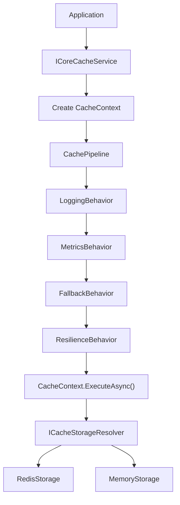
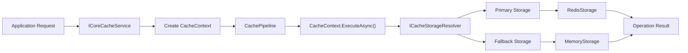
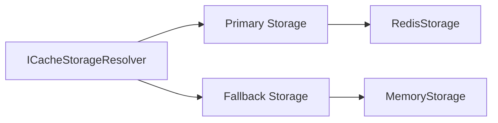
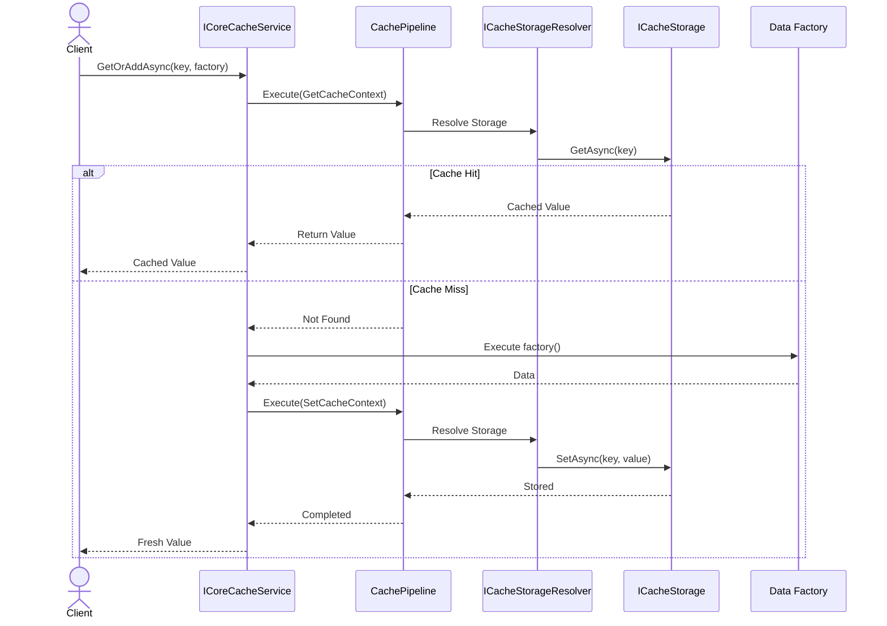
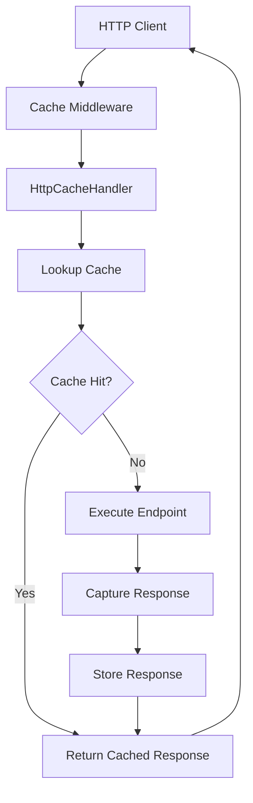
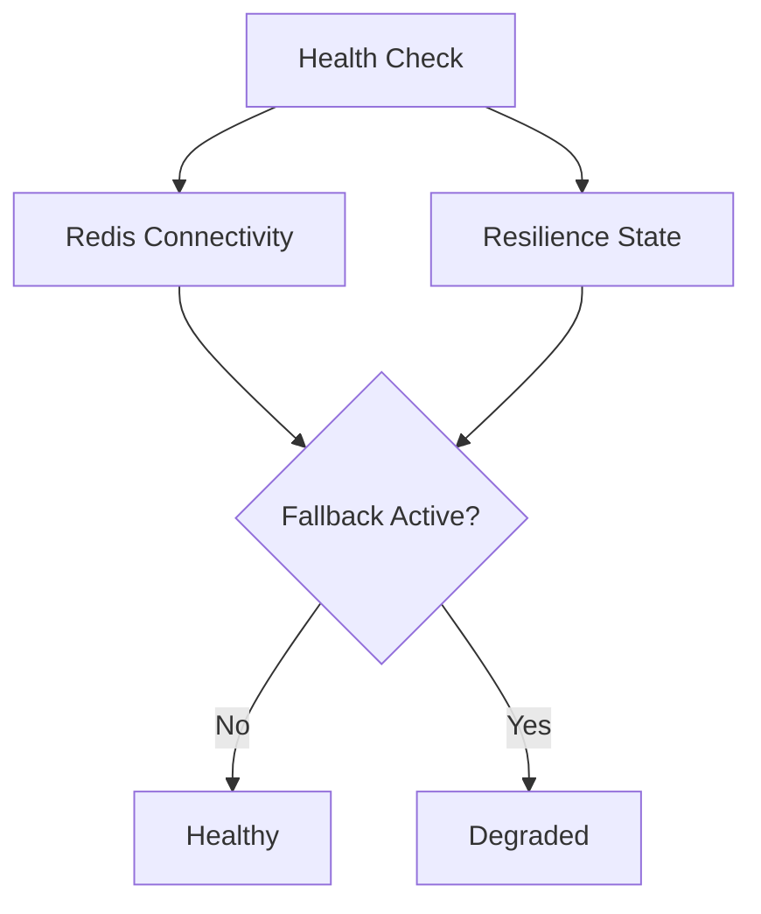

# ⚡ FGutierrez.Core.DistributedCache


## 📚 Table of Contents

- Getting Started
- Why Another Distributed Cache?
- Architecture
- Configuration
- Basic Usage
- HTTP Response Caching
- Observability
- Health Checks
- Extensibility
- Roadmap


---

# 🚀 Getting Started

Welcome to **FGutierrez.Core.DistributedCache**, a production-ready distributed caching framework for **.NET 8**.

In this guide you'll learn how to:

- Install the package
- Register the framework
- Perform your first cache operations
- Use the built-in Cache-Aside pattern

> **Estimated time:** 5 minutes

---

# Prerequisites

Before getting started, ensure you have:

- .NET 8 SDK
- An ASP.NET Core application
- *(Optional)* A Redis server

---

# Step 1 — Install the Package

Install the NuGet package.

```bash
dotnet add package FGutierrez.Core.DistributedCache
```

---

# Step 2 — Register the Framework

Register the framework in your application's dependency injection container.

```csharp
builder.Services.AddCoreDistributedCache(options =>
{
    options.Redis.Configuration = redis =>
    {
        redis.EndPoints.Add("localhost:6379");
    };
});
```

> Looking for advanced configuration options?
>
> See **04-configuration.md**.

---

# Step 3 — Inject the Cache Service

Inject `ICoreCacheService` wherever caching is required.

```csharp
public sealed class ProductService(
    ICoreCacheService cache)
{
}
```

---

# Step 4 — Store a Value

```csharp
await cache.SetAsync(
    "products:1",
    product,
    TimeSpan.FromMinutes(10));
```

---

# Step 5 — Retrieve a Value

```csharp
var product = await cache.GetAsync<Product>(
    "products:1");
```

---

# Step 6 — Use the Cache-Aside Pattern

The recommended way to retrieve cached data is through `GetOrAddAsync`.

```csharp
var product = await cache.GetOrAddAsync(
    key: $"products:{id}",
    factory: async ct =>
        await repository.GetByIdAsync(id, ct),
    expiration: TimeSpan.FromMinutes(10),
    tags: ["products"]);
```

The framework automatically:

- Checks whether the item exists in the cache.
- Executes the data factory only on cache misses.
- Stores the result.
- Applies expiration.
- Executes the configured cache pipeline.

---

# Step 7 — Enable HTTP Response Caching (Optional)

If you want to cache HTTP responses, register the middleware.

```csharp
var app = builder.Build();

app.UseCoreDistributedCache();

app.Run();
```

Then decorate your endpoints.

```csharp
[HttpGet("{id}")]
[Cacheable(expirationSeconds:300)]
public async Task<IActionResult> Get(Guid id)
{
    return Ok(await service.GetAsync(id));
}
```

For a complete guide to HTTP response caching, see **06-http-cache.md**.

---

# Need Help?

If you encounter an issue or have a suggestion:

- Open a GitHub Issue.
- Start a Discussion.
- Submit a Pull Request.

Contributions are always welcome.
---

---

# ❓ Why Another Distributed Cache?

`IDistributedCache` is an excellent abstraction for storing and retrieving data from distributed cache providers. It offers a simple and provider-agnostic API that works well for many applications.

However, as distributed systems grow in complexity, caching becomes much more than reading and writing key/value pairs.

Production applications often require resilience, observability, cache invalidation, distributed locking, HTTP response caching, and operational insights. These concerns are typically implemented separately in every project, leading to duplicated infrastructure code and inconsistent implementations.

**FGutierrez.Core.DistributedCache** was created to solve these challenges by providing a production-ready caching framework instead of just another cache provider.

---

# The Problem

Modern distributed applications frequently need capabilities such as:

- Automatic failover when Redis becomes unavailable.
- Transparent recovery after connectivity is restored.
- Cache invalidation by logical groups.
- Distributed locking to prevent cache stampede.
- Consistent serialization across providers.
- HTTP response caching.
- OpenTelemetry metrics.
- Health monitoring.
- Extensibility without modifying application code.

Most teams end up implementing these features independently, increasing maintenance costs and introducing subtle inconsistencies between projects.

---

# The Solution

FGutierrez.Core.DistributedCache builds on top of the standard caching abstraction by introducing a modular execution pipeline that handles infrastructure concerns automatically.

Rather than coupling cache operations directly to a storage provider, every operation passes through a configurable pipeline where cross-cutting concerns are executed before the selected storage provider.

This architecture keeps business code focused on application logic while the framework manages resilience, observability, and cache infrastructure transparently.

---

# Feature Comparison

| Capability | `IDistributedCache` | `FGutierrez.Core.DistributedCache` |
|------------|:-------------------:|:----------------------------------:|
| Unified Cache API | ✅ | ✅ |
| Memory Provider | ❌ | ✅ |
| Redis Provider | ✅ | ✅ |
| Composable Execution Pipeline | ❌ | ✅ |
| Automatic Redis → Memory Fallback | ❌ | ✅ |
| Automatic Cache Rehydration | ❌ | ✅ |
| Cache-Aside Pattern | ❌ | ✅ |
| Tag-based Invalidation | ❌ | ✅ |
| Distributed Locking | ❌ | ✅ |
| Multiple Serialization Formats | ❌ | ✅ |
| HTTP Response Caching | ❌ | ✅ |
| OpenTelemetry Metrics | ❌ | ✅ |
| Health Checks | ❌ | ✅ |
| Provider Resolution | ❌ | ✅ |
| Extensible Architecture | Limited | ✅ |

---

# Design Philosophy

The framework follows a few simple principles.

## Infrastructure Should Be Invisible

Applications should focus on business logic, not cache implementation details.

The framework manages provider selection, resilience, serialization, metrics, and fallback automatically.

---

## Extensibility First

New capabilities should be added without modifying existing code.

The composable execution pipeline allows new behaviors—such as compression, encryption, auditing, or tracing—to be introduced independently of the core cache implementation.

---

## Cloud-Native by Design

The framework embraces modern cloud-native development practices.

- OpenTelemetry integration
- Health Checks
- Dependency Injection
- Middleware-based integrations
- Provider abstraction
- Resilience patterns

---

## Production-Ready Defaults

The framework includes sensible defaults for production workloads while remaining fully configurable.

Examples include:

- Redis connectivity monitoring
- Automatic fallback
- Cache rehydration
- Distributed locking
- Configurable serialization
- Provider-independent API

---

# When Should You Use This Library?

FGutierrez.Core.DistributedCache is a good fit when your application requires one or more of the following:

- High-performance APIs
- Microservices
- Cloud-native applications
- Distributed systems
- HTTP response caching
- OpenTelemetry observability
- Redis with automatic failover
- Provider-independent cache implementations
- Advanced caching strategies

---

# When Is `IDistributedCache` Enough?

If your application only needs basic distributed key/value storage without additional infrastructure capabilities, the built-in `IDistributedCache` abstraction is an excellentoice.

FGutierrez.Core.DistributedCache is intended for applications that require production-grade caching features while maintaining a clean and extensible architecture.

---

# The Problem

Modern distributed applications frequently need capabilities such as:

- Automatic failover when Redis becomes unavailable.
- Transparent recovery after connectivity is restored.
- Cache invalidation by logical groups.
- Distributed locking to prevent cache stampede.
- Consistent serialization across providers.
- HTTP response caching.
- OpenTelemetry metrics.
- Health monitoring.
- Extensibility without modifying application code.

Most teams end up implementing these features independently, increasing maintenance costs and introducing subtle inconsistencies between projects.

---

# The Solution

FGutierrez.Core.DistributedCache builds on top of the standard caching abstraction by introducing a modular execution pipeline that handles infrastructure concerns automatically.

Rather than coupling cache operations directly to a storage provider, every operation passes through a configurable pipeline where cross-cutting concerns are executed before the selected storage provider.

This architecture keeps business code focused on application logic while the framework manages resilience, observability, and cache infrastructure transparently.

---

# Feature Comparison

| Capability | `IDistributedCache` | `FGutierrez.Core.DistributedCache` |
|------------|:-------------------:|:----------------------------------:|
| Unified Cache API | ✅ | ✅ |
| Memory Provider | ❌ | ✅ |
| Redis Provider | ✅ | ✅ |
| Composable Execution Pipeline | ❌ | ✅ |
| Automatic Redis → Memory Fallback | ❌ | ✅ |
| Automatic Cache Rehydration | ❌ | ✅ |
| Cache-Aside Pattern | ❌ | ✅ |
| Tag-based Invalidation | ❌ | ✅ |
| Distributed Locking | ❌ | ✅ |
| Multiple Serialization Formats | ❌ | ✅ |
| HTTP Response Caching | ❌ | ✅ |
| OpenTelemetry Metrics | ❌ | ✅ |
| Health Checks | ❌ | ✅ |
| Provider Resolution | ❌ | ✅ |
| Extensible Architecture | Limited | ✅ |

---

# Design Philosophy

The framework follows a few simple principles.

## Infrastructure Should Be Invisible

Applications should focus on business logic, not cache implementation details.

The framework manages provider selection, resilience, serialization, metrics, and fallback automatically.

---

## Extensibility First

New capabilities should be added without modifying existing code.

The composable execution pipeline allows new behaviors—such as compression, encryption, auditing, or tracing—to be introduced independently of the core cache implementation.

---

## Cloud-Native by Design

The framework embraces modern cloud-native development practices.

- OpenTelemetry integration
- Health Checks
- Dependency Injection
- Middleware-based integrations
- Provider abstraction
- Resilience patterns

---

## Production-Ready Defaults

The framework includes sensible defaults for production workloads while remaining fully configurable.

Examples include:

- Redis connectivity monitoring
- Automatic fallback
- Cache rehydration
- Distributed locking
- Configurable serialization
- Provider-independent API

---

# When Should You Use This Library?

FGutierrez.Core.DistributedCache is a good fit when your application requires one or more of the following:

- High-performance APIs
- Microservices
- Cloud-native applications
- Distributed systems
- HTTP response caching
- OpenTelemetry observability
- Redis with automatic failover
- Provider-independent cache implementations
- Advanced caching strategies

---

# When Is `IDistributedCache` Enough?

If your application only needs basic distributed key/value storage without additional infrastructure capabilities, the built-in `IDistributedCache` abstraction is an excellent choice.

FGutierrez.Core.DistributedCache is intended for applications that require production-grade caching features while maintaining a clean and extensible architecture.

---

---

# 🏗️ Architecture

`FGutierrez.Core.DistributedCache` is built around a composable pipeline architecture that separates cache operations from storage implementations.

Instead of interacting directly with Redis or Memory, every cache operation is represented by a `CacheContext` and executed through the `CachePipeline`. During execution, cross-cutting concerns such as logging, metrics, resilience, and automatic fallback are applied before the operation reaches the selected storage provider.

This architecture keeps business code independent from infrastructure concerns while allowing new behaviors and storage providers to be introduced without changing the public API.



---

## 🎯 Design Goals

The framework is designed around a few core architectural principles:

- Keep business code independent from storage providers.
- Centralize cross-cutting concerns through a composable execution pipeline.
- Support multiple cache providers behind a single abstraction.
- Allow new behaviors to be introduced without modifying the cache service.
- Keep storage implementations isolated from application code.

---

# 🏛️ Architectural Patterns

`FGutierrez.Core.DistributedCache` is built on a combination of well-established architectural and design patterns. Each pattern addresses a specific concern while keeping the framework modular, extensible, and maintainable.

| Pattern | Purpose |
|----------|---------|
| **Pipeline** | Executes every cache operation through a configurable chain of reusable behaviors. |
| **Chain of Responsibility** | Allows each behavior to observe, enrich, or modify an operation before delegating to the next behavior. |
| **Strategy** | Enables interchangeable implementations for storage providers, serializers, and distributed locks. |
| **Factory** | Creates operation-specific `CacheContext` instances that encapsulate the execution state for each cache operation. |
| **Provider Pattern** | Abstracts Memory and Redis behind a common `ICacheStorage` interface. |
| **Cache-Aside** | Simplifies cache population through the built-in `GetOrAddAsync()` workflow. |

These patterns work together to separate business logic from infrastructure concerns while allowing new behaviors and storage providers to be introduced without changing the public API.

---

# 🧩 Core Components

The framework is composed of a small set of components, each with a clearly defined responsibility.

| Component | Responsibility |
|-----------|----------------|
| **ICoreCacheService** | Public entry point for all cache operations. Creates the appropriate `CacheContext` and delegates execution to the pipeline. |
| **CacheContext** | Represents a single cache operation. Encapsulates its state, execution logic, and selected storage provider. |
| **CachePipeline** | Coordinates the execution of every cache operation through a chain of reusable behaviors before delegating to the selected storage provider. |
| **ICacheBehavior** | Defines reusable cross-cutting behaviors such as logging, metrics, resilience, and fallback. |
| **ICacheStorageResolver** | Resolves the primary and fallback storage providers for the current operation. |
| **ICacheStorage** | Provider-agnostic abstraction implemented by every storage provider. |

The interaction between these components keeps the public API small while allowing the infrastructure to evolve independently.

---

# 🔄 Execution Lifecycle

Every cache operation follows the same execution lifecycle regardless of the operation type or selected storage provider.

The application communicates only with `ICoreCacheService`. A specialized `CacheContext` is created for the requested operation, then executed through the `CachePipeline`. Each registered behavior may observe, enrich, or modify the execution before the operation reaches the selected storage provider.



During execution, behaviors such as logging, metrics, resilience policies, and automatic fallback are applied transparently.

Because these concerns are implemented as reusable pipeline behaviors, additional capabilities such as compression, encryption, tracing, or auditing can be introduced without modifying either the cache service or the storage providers.

---

# ⚙️ Pipeline Behaviors

The `CachePipeline` executes each registered behavior sequentially before delegating the operation to the selected storage provider.

Each behavior has a single responsibility.

| Behavior | Responsibility |
|----------|----------------|
| **LoggingBehavior** | Logs cache operations and failures. |
| **MetricsBehavior** | Records cache metrics using OpenTelemetry. |
| **FallbackBehavior** | Switches to the fallback provider when the primary provider becomes unavailable. |
| **ResilienceBehavior** | Executes cache operations through configured Polly resilience policies. |

Because behaviors are independent, the pipeline can evolve without changing the public API.

Potential future behaviors include:

- Compression
- Encryption
- Tracing
- Auditing
- Validation
- Rate limiting

---

# 🗄️ Storage Layer

The storage layer is completely independent from the execution pipeline.

Every storage provider implements the same `ICacheStorage` abstraction, allowing providers to be exchanged transparently during execution.



### Redis Storage

```text
RedisStorage
│
├── PayloadSerializer
├── RedisTagIndex
├── RedisLockProvider
└── RedisKeyBuilder
```

### Memory Storage

```text
MemoryStorage
│
├── MemoryTagIndex
├── MemoryLockProvider
├── MemoryKeyTracker
└── CacheEntryFactory
```

Because both providers implement the same abstraction, the pipeline can switch providers transparently without affecting application code.

---

# ⚡ Cache-Aside Execution

The framework provides a built-in implementation of the Cache-Aside pattern through `GetOrAddAsync()`.



Because every cache operation shares the same execution pipeline, cross-cutting concerns such as logging, metrics, resilience, fallback, and future behaviors are applied consistently across the entire framework.

---

---

# ⚙️ Configuration

This guide describes every configuration option available in
**FGutierrez.Core.DistributedCache**.

You'll learn how to configure:

- Cache providers
- Serialization
- Default expiration
- Redis connectivity
- Memory-only mode
- HTTP cache settings
- Cache rehydration
- appsettings.json integration

---

# Configuration Overview

The framework is configured through the `AddCoreDistributedCache()` extension.

```csharp
builder.Services.AddCoreDistributedCache(options =>
{
    // Configure the framework here
});
```

---

# Configuration Options

| Option | Description | Default |
|----------|-------------|---------|
| DefaultProvider | Default cache provider | Redis |
| InstanceName | Cache key prefix | null |
| DefaultExpiration | Default cache lifetime | 30 minutes |
| SerializerType | Serialization format | Json |
| MaxCacheableSize | Maximum cached HTTP response | 1 MB |
| RehydrationInterval | Redis recovery interval | 30 seconds |

---

# Choosing a Cache Provider

The framework supports multiple cache providers.

## Redis

Recommended for production workloads.

```csharp
builder.Services.AddCoreDistributedCache(options =>
{
    options.Redis.Configuration = redis =>
    {
        redis.EndPoints.Add("localhost:6379");
    };
});
```

### When to use Redis

- Distributed applications
- Multiple application instances
- Kubernetes
- Cloud deployments

---

## Memory

Ideal for:

- Local development
- Unit tests
- Small applications

```csharp
builder.Services.AddCoreDistributedCache(options =>
{
    options.Redis.Enabled = false;
});
```

---

# Default Provider

Choose which provider the framework should use.

```csharp
options.DefaultProvider =
    CacheProviderType.Redis;
```

or

```csharp
options.DefaultProvider =
    CacheProviderType.Memory;
```

---

# Instance Name

Prefixes every cache key.

```csharp
options.InstanceName = "CatalogApi";
```

Example generated key:

```text
CatalogApi:products:15
```

Using an instance name is recommended whenever multiple applications share the same Redis server.

---

# Cache Expiration

Configure the default cache lifetime.

```csharp
options.DefaultExpiration =
    TimeSpan.FromMinutes(30);
```

Individual cache operations can override this value.

---

# Serialization

Choose the serializer that best fits your application.

## JSON

```csharp
options.SerializerType =
    SerializerType.Json;
```

Recommended for:

- Simplicity
- Debugging
- Compatibility

---

## MessagePack

```csharp
options.SerializerType =
    SerializerType.MessagePack;
```

Recommended for:

- High-performance APIs
- Reduced payload size

---

## Protocol Buffers

```csharp
options.SerializerType =
    SerializerType.Protobuf;
```

Recommended for:

- Cross-platform communication
- Compact binary serialization

---

# Redis Configuration

The framework uses the native
`StackExchange.Redis.ConfigurationOptions`.

Example:

```csharp
options.Redis.Configuration = redis =>
{
    redis.EndPoints.Add("localhost:6379");

    redis.Password = "...";

    redis.Ssl = true;

    redis.ConnectTimeout = 5000;

    redis.AbortOnConnectFail = false;
};
```

---

# HTTP Cache

Maximum response size stored by the middleware.

```csharp
options.MaxCacheableSize =
    1024 * 1024;
```

Default:

```text
1 MB
```

---

# Cache Rehydration

Configure how frequently the framework checks whether Redis has recovered.

```csharp
options.RehydrationInterval =
    TimeSpan.FromSeconds(30);
```

---

# Using appsettings.json

```json
{
  "DistributedCache": {
    "DefaultProvider": "Redis",

    "InstanceName": "CatalogApi",

    "DefaultExpiration": "00:30:00",

    "SerializerType": "MessagePack",

    "Redis": {
      "Enabled": true,
      "Host": "localhost:6379",
      "Password": ""
    }
  }
}
```

Bind the configuration:

```csharp
var section =
    builder.Configuration.GetSection("DistributedCache");

builder.Services.AddCoreDistributedCache(options =>
{
    section.Bind(options);

    options.Redis.Configuration = redis =>
    {
        redis.EndPoints.Add(section["Redis:Host"]!);

        redis.Password =
            section["Redis:Password"];
    };
});
```

---

# Recommended Configurations

## Development

| Setting | Value |
|----------|-------|
| Provider | Memory |
| Serializer | Json |
| Expiration | 5 minutes |

---

## Staging

| Setting | Value |
|----------|-------|
| Provider | Redis |
| Serializer | Json |
| Expiration | 15 minutes |

---

## Production

| Setting | Value |
|----------|-------|
| Provider | Redis |
| Serializer | MessagePack |
| Expiration | 30 minutes |

---

# Best Practices

✅ Use Redis for distributed applications.

✅ Set an `InstanceName` when sharing Redis.

✅ Prefer MessagePack for performance-sensitive workloads.

✅ Use JSON during development if payload readability is important.

✅ Configure sensible expiration values.

---

# 🧑‍💻 Basic Usage

This guide explains how to use the public API exposed by
`ICoreCacheService`.

By the end of this guide you'll know how to:

- Store values
- Retrieve values
- Remove entries
- Invalidate tags
- Use the Cache-Aside pattern
- Configure expiration

---

# Injecting the Cache Service

```csharp
public sealed class ProductService(
    ICoreCacheService cache)
{
}
```

---

# Store Data

Store an object in the cache.

```csharp
await cache.SetAsync(
    "products:1",
    product,
    TimeSpan.FromMinutes(10));
```

---

# Retrieve Data

```csharp
var product =
    await cache.GetAsync<Product>(
        "products:1");
```

Returns:

- the cached object
- or `null` if the entry does not exist.

---

# Check if an Entry Exists

```csharp
var exists =
    await cache.ExistsAsync(
        "products:1");
```

---

# Remove an Entry

```csharp
await cache.RemoveAsync(
    "products:1");
```

---

# Cache-Aside Pattern

The recommended approach for most scenarios.

```csharp
var product =
    await cache.GetOrAddAsync(
        key: $"products:{id}",
        factory: async ct =>
            await repository.GetByIdAsync(id, ct),
        expiration: TimeSpan.FromMinutes(10));
```

The factory executes only when the cache entry does not exist.

---

# Using Expiration

Expiration can be specified per operation.

```csharp
await cache.SetAsync(
    "products",
    products,
    TimeSpan.FromMinutes(5));
```

If omitted, the framework uses the configured default expiration.

---

# Using Tags

Tags allow related cache entries to be grouped together.

```csharp
await cache.SetAsync(
    key: $"product:{id}",
    value: product,
    expiration: TimeSpan.FromMinutes(10),
    tags: ["products"]);
```

---

# Invalidate a Tag

```csharp
await cache.InvalidateByTagAsync(
    "products");
```

All cache entries associated with that tag are removed.

---

# Working with CancellationToken

All asynchronous operations support cancellation.

```csharp
await cache.GetAsync<Product>(
    key,
    cancellationToken);
```

---

# Typical Usage Pattern

```csharp
public async Task<Product?> GetAsync(Guid id)
{
    return await cache.GetOrAddAsync(
        $"products:{id}",
        async ct =>
            await repository.GetByIdAsync(id, ct),
        expiration: TimeSpan.FromMinutes(15),
        tags: ["products"]);
}
```

This is the recommended way to integrate the framework into application services.

---

# Best Practices

✅ Prefer `GetOrAddAsync()` over manually calling `GetAsync()` and `SetAsync()`.

✅ Use meaningful cache keys.

✅ Group related entries with tags.

✅ Configure sensible expiration values.

✅ Avoid caching frequently changing data.

---

# 🌐 HTTP Response Caching

`FGutierrez.Core.DistributedCache` provides declarative HTTP response caching for ASP.NET Core applications.

Instead of implementing cache management logic inside controllers or Minimal APIs, the framework automatically handles cache lookup, storage, expiration, and invalidation through middleware.

---

# Overview

When an endpoint is decorated with the `Cacheable` attribute, the framework automatically:

- Generates a cache key
- Checks whether a cached response already exists
- Returns cached responses immediately
- Executes the endpoint on cache misses
- Captures successful responses
- Stores responses using the configured cache provider
- Applies expiration policies
- Supports tag-based invalidation

No additional code is required inside your endpoints.

---

# Architecture



---

# Enable the Middleware

Register the middleware.

```csharp
var app = builder.Build();

app.UseCoreDistributedCache();

app.Run();
```

---

# Basic Usage

Decorate an endpoint.

```csharp
[HttpGet("{id}")]
[Cacheable(expirationSeconds:300)]
public async Task<IActionResult> Get(Guid id)
{
    return Ok(await service.GetAsync(id));
}
```

The response will be cached for five minutes.

---

# Minimal API Example

```csharp
app.MapGet("/products/{id}",
    async (Guid id, IProductService service) =>
    {
        return Results.Ok(await service.GetAsync(id));
    })
.WithMetadata(new CacheableAttribute(300));
```

---

# Cache Expiration

Specify the cache lifetime.

```csharp
[Cacheable(expirationSeconds:600)]
```

or

```csharp
[Cacheable(expirationSeconds:60)]
```

---

# Using Cache Tags

Tags allow multiple cached responses to be invalidated together.

```csharp
[Cacheable(
    expirationSeconds:300,
    tag:"Products")]
```

Later:

```csharp
await cache.InvalidateByTagAsync("Products");
```

---

# Cache Key Generation

Cache keys are generated automatically using:

- Instance name
- HTTP method
- Request path
- Query string

Example:

```text
catalog-api:GET:/products/15?page=2
```

This guarantees different URLs are cached independently.

---

# Cache Hit

```
Request
      │
      ▼
Cached Response Exists?
      │
     Yes
      │
      ▼
Return Cached Response
```

No endpoint execution occurs.

---

# Cache Miss

```
Request
      │
      ▼
Cache Miss
      │
      ▼
Execute Endpoint
      │
      ▼
Capture Response
      │
      ▼
Store Response
      │
      ▼
Return Response
```

---

# Provider Independence

HTTP response caching works with any configured provider.

Supported providers:

- Memory
- Redis

Changing providers requires no changes to controllers.

---

# Pipeline Integration

Every HTTP cache operation executes through the cache pipeline.

```text
Logging

↓

Metrics

↓

Fallback

↓

Resilience

↓

Storage
```

This means HTTP response caching automatically benefits from:

- Logging
- OpenTelemetry Metrics
- Automatic Redis fallback
- Resilience policies

---

# Best Practices

✅ Cache GET endpoints only.

✅ Avoid caching endpoints with user-specific responses.

✅ Use cache tags for related resources.

✅ Choose expiration based on data volatility.

✅ Use Redis in production.

---

# Limitations

HTTP response caching should not be used for:

- Authentication endpoints
- Authorization endpoints
- Payment operations
- Highly personalized responses
- Streaming endpoints

---

# 📊 Observability

`FGutierrez.Core.DistributedCache` includes built-in observability based on **OpenTelemetry Metrics**.

Every cache operation automatically emits metrics that can be consumed by any OpenTelemetry-compatible backend, allowing you to monitor cache performance without modifying your application code.

---

# Why Observability Matters

Caching is only effective when it can be measured.

The framework publishes telemetry that helps answer questions such as:

- Is the cache being used effectively?
- What is the cache hit ratio?
- How many cache misses occur?
- Is Redis responding correctly?
- How many cache operations are executed?
- How long do cache operations take?

---

# Architecture

```mermaid
flowchart LR

    Application

    --> Cache

    --> CachePipeline

    --> CacheMetrics

    --> OpenTelemetry

    --> OTLP Exporter

    --> Monitoring Platform
```

---

# Built-in Metrics

The framework publishes the following metrics.

| Metric | Description |
|----------|-------------|
| `cache.distributed.hits` | Successful cache lookups |
| `cache.distributed.misses` | Cache misses |
| `cache.distributed.operations` | Total cache operations |
| `cache.distributed.duration` | Cache execution duration |
| `cache.distributed.hit_rate` | Cache hit ratio |

> Some metrics may be introduced in future releases.

---

# Registering the Meter

The package automatically registers the following meter.

```text
Core.DistributedCache
```

Applications only need to add the meter to OpenTelemetry.

```csharp
builder.Services
    .AddOpenTelemetry()
    .WithMetrics(metrics =>
    {
        metrics.AddMeter("Core.DistributedCache");

        metrics.AddPrometheusExporter();
    });
```

---

# Compatible Platforms

The metrics can be exported to any OTLP-compatible backend.

| Platform | Supported |
|-----------|:---------:|
| Prometheus | ✅ |
| Grafana | ✅ |
| Azure Monitor | ✅ |
| Jaeger | ✅ |
| Elastic | ✅ |
| Datadog | ✅ |
| OTLP | ✅ |

---

# Example Dashboard

Typical dashboards include:

- Cache Hits
- Cache Misses
- Hit Ratio
- Average Response Time
- Total Operations

*(Add Grafana screenshots here.)*

---

# Extending Observability

Because every cache operation flows through the **CachePipeline**, new telemetry can be added without modifying the framework.

Examples include:

- Custom business metrics
- Request tracing
- Performance timing
- Audit events
- Telemetry enrichment

Simply create a custom pipeline behavior.

---

# Best Practices

✅ Monitor cache hit ratio.

✅ Track cache misses.

✅ Alert on Redis failures.

✅ Combine metrics with Health Checks.

✅ Export telemetry using OTLP.

---

# 🩺 Health Checks

FGutierrez.Core.DistributedCache integrates with the ASP.NET Core Health Checks infrastructure to provide visibility into the operational state of the cache layer.

Unlike a simple Redis connectivity check, the framework reports the actual health of the caching infrastructure, including whether the application is currently operating with the primary provider or using the configured fallback storage.

---

# Why It Matters

In production environments, cache infrastructure can become temporarily unavailable.

Rather than failing requests immediately, the framework can automatically switch to the fallback provider while continuing to serve traffic.

The Health Check reflects this state so that monitoring systems can distinguish between:

- A healthy cache infrastructure.
- A degraded cache infrastructure operating in fallback mode.

---

# Registering Health Checks

Register the ASP.NET Core Health Checks service.

```csharp
builder.Services.AddHealthChecks();
```

When `AddCoreDistributedCache()` is called, the framework automatically registers its own health check.

No additional configuration is required.

---

# Expose the Health Endpoint

Expose the health endpoint as usual.

```csharp
app.MapHealthChecks("/health");
```

Example:

```
GET /health
```

---

# Health States

The framework reports two operational states.

| Status | Description |
|---------|-------------|
| 🟢 Healthy | Redis is available and all cache operations are executed using the primary provider. |
| 🟡 Degraded | Redis is unavailable and the framework is serving requests using the fallback Memory provider. |

Because the fallback provider keeps the application running, a degraded state does not necessarily indicate application failure.

---

# How It Works



The health check combines information from:

- Redis connectivity.
- The resilience pipeline.
- The current fallback state.

This provides a more accurate health report than a simple Redis ping.

---

# Example Response

Healthy

```json
{
  "status": "Healthy"
}
```

Degraded

```json
{
  "status": "Degraded"
}
```

---

# Monitoring

The health endpoint can be consumed by:

- Kubernetes
- Azure App Service
- Docker
- Prometheus
- Grafana
- Azure Monitor
- Any ASP.NET Core compatible monitoring platform

---

# Operational Recommendations

## Healthy

No action required.

The framework is operating normally.

---

## Degraded

The application is currently using the in-memory fallback provider.

Recommended actions:

- Verify Redis availability.
- Review Redis logs.
- Check network connectivity.
- Confirm that Redis authentication is valid.

Once Redis becomes available again, the framework automatically resumes using the primary provider.

---

# Cache Rehydration

If automatic cache rehydration is enabled, entries stored in memory while Redis was unavailable are synchronized back to Redis after connectivity is restored.

This process runs automatically in the background.

No manual intervention is required.

---

# Best Practices

- Always expose the health endpoint.
- Monitor degraded states instead of only failures.
- Combine Health Checks with OpenTelemetry metrics.
- Use readiness probes in Kubernetes.
- Configure alerts for prolonged degraded states.

---

# Next Step

Continue with:

➡️ **09-extensibility.md**

---

# 🧩 Extensibility

One of the main goals of **FGutierrez.Core.DistributedCache** is to provide a caching framework that can evolve without requiring modifications to existing application code.

Rather than embedding infrastructure concerns directly into the cache service, the framework exposes extensibility points that allow new behaviors, storage providers, serializers, and other components to be added independently.

This document describes the available extension points and when to use each one.

---

# Extension Points

The framework can be extended in several ways.

| Extension Point | Purpose |
|-----------------|---------|
| Cache Pipeline | Add cross-cutting behaviors |
| Storage Providers | Support new cache backends |
| Serializers | Support additional serialization formats |
| Cache Key Generation | Customize cache key creation |
| Metrics | Publish custom telemetry |
| Dependency Injection | Replace default implementations |

---

# Extending the Cache Pipeline

Every cache operation flows through the pipeline.

```text
Application

↓

Cache Service

↓

Pipeline

↓

Storage
```

Because of this architecture, new behaviors can be introduced without modifying existing code.

Examples include:

- Compression
- Encryption
- Auditing
- Tracing
- Validation
- Custom Metrics

---

# Creating a Custom Behavior

Implement the `ICacheBehavior` interface.

```csharp
public sealed class CompressionBehavior
    : ICacheBehavior
{
    public async Task InvokeAsync(
        CacheContext context,
        CacheBehaviorDelegate next)
    {
        // Execute custom logic

        await next(context);

        // Execute additional logic
    }
}
```

Register the behavior.

```csharp
services.AddSingleton<ICacheBehavior, CompressionBehavior>();
```

The new behavior automatically becomes part of the execution pipeline.

---

# Creating a Custom Storage Provider

The framework supports multiple storage providers through the `ICacheStorage` abstraction.

```text
ICacheStorage

├── MemoryStorage

├── RedisStorage

└── YourCustomStorage
```

Implement the storage interface.

```csharp
public sealed class CosmosStorage
    : ICacheStorage
{
    // Implementation
}
```

Register it through dependency injection.

Once registered, the provider can participate in the storage resolution process.

---

# Creating a Custom Serializer

Serialization is provider independent.

Implement the serializer interface.

```csharp
public sealed class AvroSerializer
    : IPayloadSerializer
{
}
```

Then register the serializer.

```csharp
services.AddSingleton<IPayloadSerializer, AvroSerializer>();
```

Applications can switch serialization strategies without changing cache code.

---

# Replacing Default Services

Every core service is registered through dependency injection.

Applications can replace framework services with custom implementations when necessary.

Example:

```csharp
services.Replace(
    ServiceDescriptor.Singleton<
        ICacheKeyBuilder,
        CustomCacheKeyBuilder>());
```

---

# Custom Cache Key Generation

By default, cache keys are generated consistently across all providers.

Applications that require custom naming conventions can replace the key builder implementation.

Examples:

- Tenant-aware keys
- Region prefixes
- Environment prefixes
- Custom hashing

---

# Adding Custom Metrics

The framework exposes OpenTelemetry metrics.

Additional metrics can be collected through custom pipeline behaviors.

Examples:

- Business metrics
- SLA measurements
- Tenant metrics
- Custom counters

---

# Future Extension Points

The pipeline architecture enables additional capabilities without breaking the public API.

Examples include:

- CompressionBehavior
- EncryptionBehavior
- ValidationBehavior
- AuditBehavior
- TracingBehavior
- RateLimitingBehavior
- ReplicationBehavior
- WarmupBehavior

---

# Design Principles

When extending the framework, follow these principles:

- Single Responsibility Principle
- Prefer composition over inheritance
- Keep behaviors independent
- Avoid coupling to storage implementations
- Use dependency injection
- Keep custom behaviors stateless whenever possible

---

# Best Practices

✅ Create one behavior per concern.

✅ Do not modify existing framework behaviors.

✅ Prefer pipeline extensions over service replacement.

✅ Keep custom providers provider-independent.

✅ Preserve asynchronous execution.

---

---

# 🗺️ Roadmap

This document outlines the planned evolution of **FGutierrez.Core.DistributedCache**.

The roadmap is intended to provide visibility into the long-term direction of the project. Features may evolve based on community feedback and real-world adoption.

---

# Guiding Principles

The framework will continue to evolve following these principles:

- Production-first
- Cloud-native
- Provider-independent
- Extensible architecture
- OpenTelemetry-first
- Backward compatibility whenever possible

---

# ✅ Completed

The following capabilities are already available.

## Core Infrastructure

- [x] Memory cache provider
- [x] Redis cache provider
- [x] Provider abstraction
- [x] Dependency Injection integration

---

## Cache Pipeline

- [x] Composable execution pipeline
- [x] Logging behavior
- [x] Metrics behavior
- [x] Resilience behavior
- [x] Fallback behavior

---

## Caching Features

- [x] Cache Aside pattern (`GetOrAddAsync`)
- [x] Tag-based invalidation
- [x] Distributed locking
- [x] Automatic cache rehydration
- [x] HTTP response caching

---

## Serialization

- [x] JSON
- [x] MessagePack
- [x] Protocol Buffers

---

## Observability

- [x] OpenTelemetry Metrics
- [x] Health Checks

---

# 🚧 Short-Term

The next releases will focus on improving flexibility and performance.

## Pipeline

- [ ] Configurable pipeline ordering
- [ ] Conditional behaviors
- [ ] Custom behavior registration

---

## Performance

- [ ] Compression behavior
- [ ] Benchmark suite
- [ ] Additional performance metrics

---

## Developer Experience

- [ ] More samples
- [ ] Extended documentation
- [ ] Analyzer package
- [ ] Source Link support

---

# 🚀 Mid-Term

The following features will expand the framework beyond Redis.

## Storage Providers

- [ ] SQL Server
- [ ] PostgreSQL
- [ ] Cosmos DB

---

## Cache Strategies

- [ ] Sliding expiration
- [ ] Cache warming
- [ ] Background preloading
- [ ] Hybrid cache strategies

---

## Distributed Features

- [ ] Distributed invalidation events
- [ ] Cache synchronization

---

# 🔮 Long-Term Vision

Future versions aim to transform the framework into a complete caching platform.

## Multi-Level Cache

- [ ] L1 Memory
- [ ] L2 Redis
- [ ] Transparent synchronization

---

## Provider SDK

- [ ] Public provider SDK
- [ ] Storage provider templates
- [ ] Community provider support

---

## Advanced Features

- [ ] Adaptive expiration
- [ ] Cache analytics
- [ ] Native AOT optimizations
- [ ] Source Generator support

---

# 💡 Future Pipeline Behaviors

The pipeline architecture makes it possible to introduce additional behaviors without modifying existing code.

Possible future behaviors include:

- [ ] CompressionBehavior
- [ ] EncryptionBehavior
- [ ] TracingBehavior
- [ ] AuditBehavior
- [ ] ValidationBehavior
- [ ] RateLimitingBehavior
- [ ] CacheWarmupBehavior
- [ ] CacheReplicationBehavior

---

# Community Ideas

Ideas proposed by the community may be incorporated into future releases.

Suggestions are welcome through:

- GitHub Issues
- GitHub Discussions
- Pull Requests

---

# Release Strategy

The project follows Semantic Versioning.

| Version | Focus |
|---------|-------|
| 1.x | Stability, bug fixes, documentation |
| 2.x | New providers and extensibility |
| 3.x | Advanced caching strategies |
| 4.x | Ecosystem integration |

---

# Contributing

If you'd like to contribute to any roadmap item, feel free to open an issue or submit a Pull Request.

Community contributions are always welcome.

---

