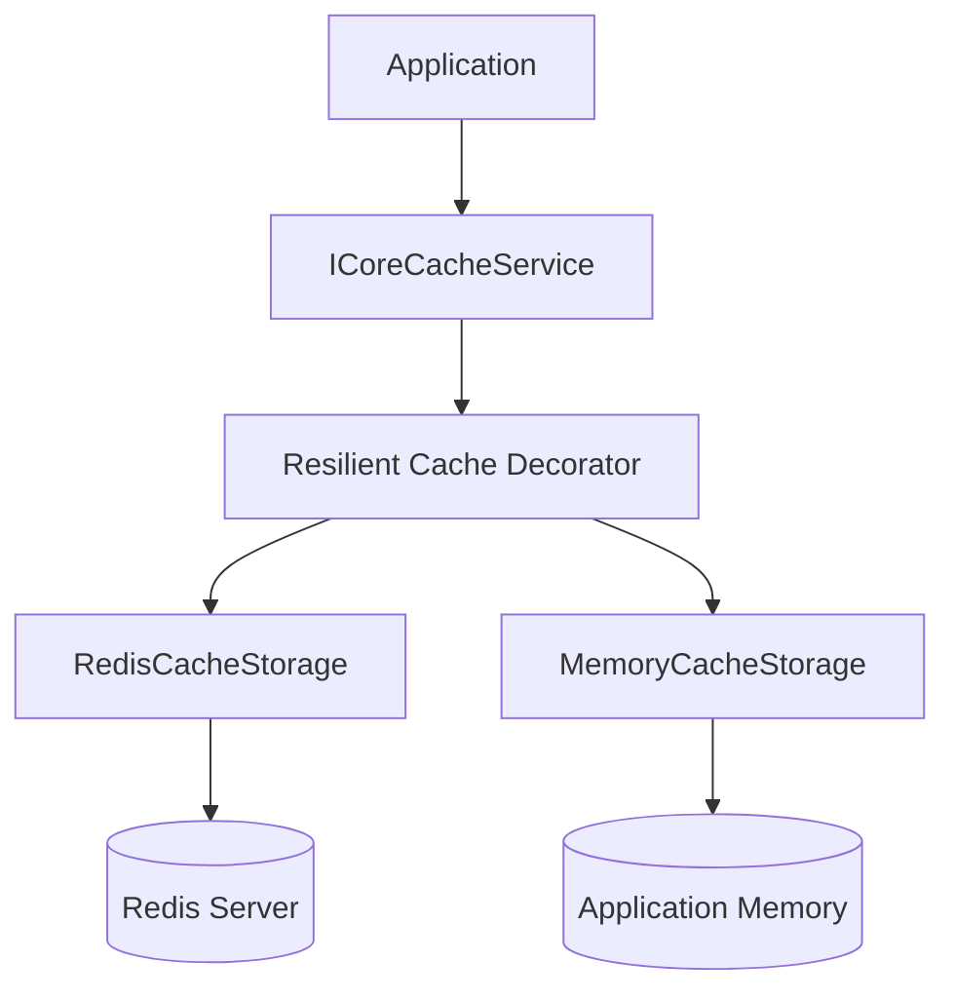
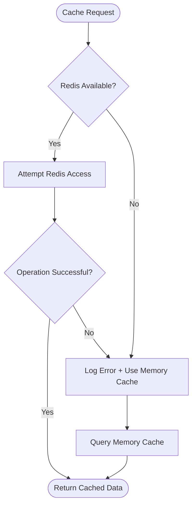
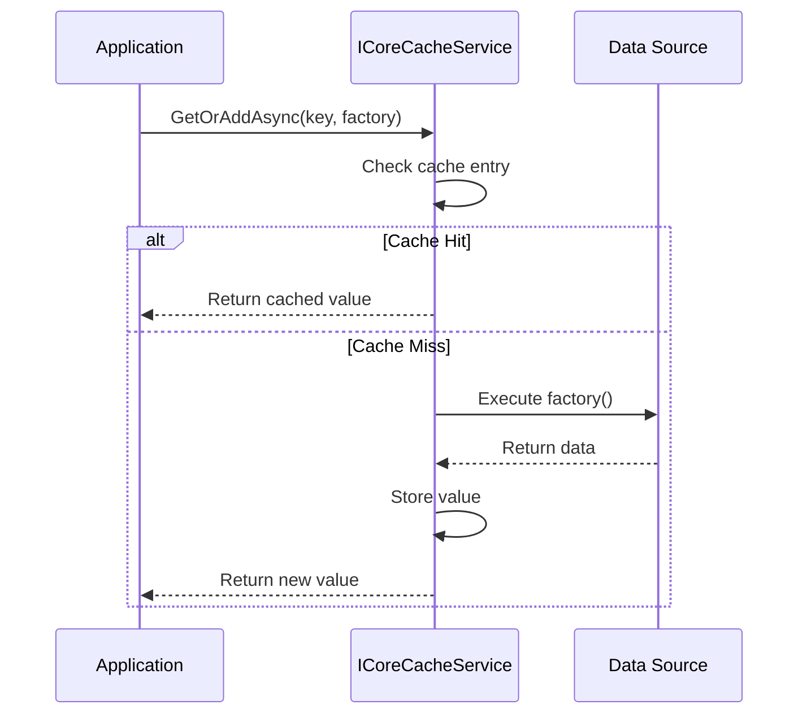
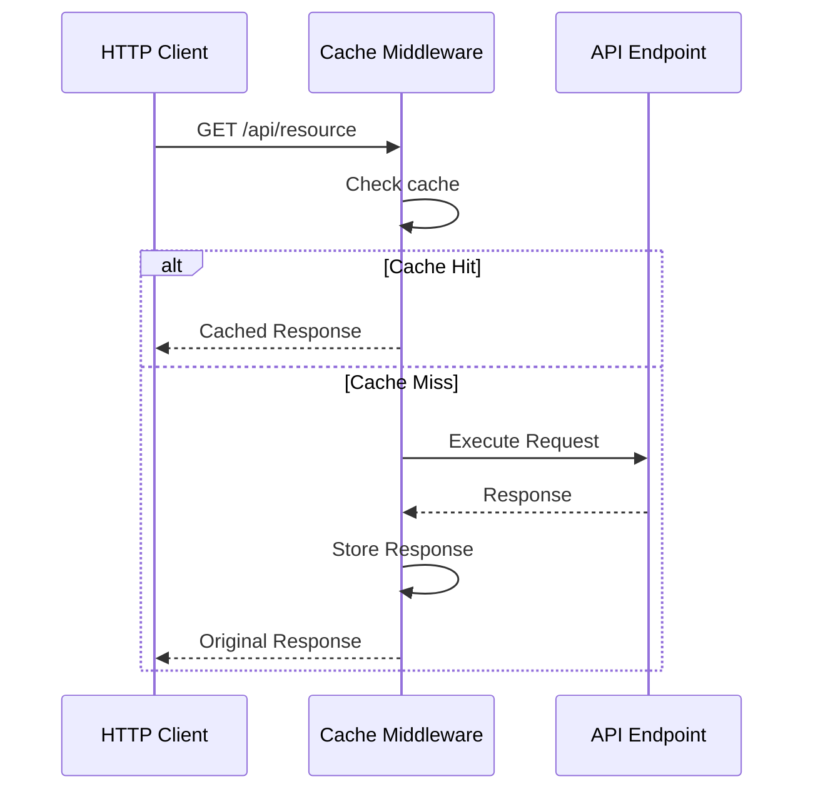

# ⚡ FGutierrez.Core.DistributedCache


---

## 🚀 Overview

**FGutierrez.Core.DistributedCache** is a high-performance distributed caching library for **.NET 8** designed to provide a unified abstraction over multiple cache providers.

The library simplifies cache integration by providing:

- In-memory caching
- Redis distributed caching
- Automatic resilience and fallback strategies
- HTTP response caching middleware
- OpenTelemetry metrics
- Health checks
- Provider-based extensibility

Built following a **cloud-native approach**, the library allows applications to consume caching capabilities without being coupled to a specific infrastructure provider.

---

## ✨ Key Features

| Feature | Description |
|---|---|
| 🧩 Unified API | Single abstraction for multiple cache providers |
| ⚡ High Performance | Optimized cache access patterns |
| 🔄 Resilience | Automatic fallback when distributed cache is unavailable |
| 🧠 Cache Aside Pattern | Built-in GetOrAddAsync workflow |
| 🌐 HTTP Middleware | Response caching support for APIs |
| 📊 Observability | OpenTelemetry metrics integration |
| 🩺 Health Checks | Cache provider availability monitoring |

---

## 🏗 Architecture



---

## 🛡️ Resilience Flow



---

## ⚡ GetOrAddAsync Cache-Aside Pattern



---

## 🌐 HTTP Cache Middleware Lifecycle



---

## 📦 Installation

```bash
dotnet add package FGutierrez.Core.DistributedCache
```

---

## ⚙️ Configuration

## Redis Enabled

```csharp
builder.Services.AddCoreDistributedCache(options =>
{
    options.InstanceName = "MyApplication";

    options.DefaultExpiration = TimeSpan.FromMinutes(30);

    options.Redis.Enabled = true;

    options.Redis.Configuration = redis =>
    {
        redis.EndPoints.Add("localhost", 6379);
        redis.AbortOnConnectFail = false;
    };
});
```

---

## 🧑‍💻 Usage Example

```csharp
public class ProductService
{
    private readonly ICoreCacheService _cache;

    public ProductService(ICoreCacheService cache)
    {
        _cache = cache;
    }


    public async Task<Product> GetAsync(Guid id)
    {
        return await _cache.GetOrAddAsync(
            $"product:{id}",
            async () =>
            {
                return await LoadFromDatabase(id);
            });
    }
}
```

---

## 📊 Observability

The library exposes cache metrics through **OpenTelemetry**.

| Metric | Description |
|---|---|
| `cache.distributed.hits` | Successful cache retrievals |
| `cache.distributed.misses` | Cache lookup failures |
| `cache.distributed.errors` | Provider errors |
| `cache.distributed.fallbacks` | Resilience fallback executions |

Compatible with any OpenTelemetry backend:

- Grafana
- Prometheus
- Jaeger
- Azure Monitor
- Elastic Observability
- Other OTLP-compatible platforms

---

## 🩺 Health Checks

The library integrates with:

```csharp
builder.Services.AddHealthChecks();
```

Allowing monitoring of:

- Redis availability
- Memory cache status
- Provider connectivity

---

## 🛠️ Requirements

- .NET 8 SDK
- Microsoft.Extensions.Caching.Memory
- StackExchange.Redis
- OpenTelemetry
- Microsoft.Extensions.Diagnostics.HealthChecks

---

## 🏗 Design Principles

FGutierrez.Core.DistributedCache follows:

- Clean Architecture principles
- Provider-based extensibility
- High cohesion / low coupling
- Cloud-native design
- Resilient infrastructure patterns
- Observability-first development

---

## 📌 Roadmap

- [x] Memory Cache provider
- [x] Redis provider
- [x] Cache Aside pattern
- [x] Resilience fallback
- [x] OpenTelemetry metrics
- [x] Health checks

Future:

- [ ] SQL Server cache provider
- [ ] PostgreSQL cache provider
- [ ] Multi-level distributed cache
- [ ] Cache invalidation events

---

## 🤝 Contributing

Contributions are welcome.

1. Fork the repository
2. Create a feature branch
3. Commit your changes
4. Open a Pull Request

---

## 📄 License

MIT License © Federin Pastor Gutierrez Ortiz

See the LICENSE file for details.

---

## ⭐ Support

If this ecosystem helps you, consider giving the repository a star on GitHub.

Building modern .NET distributed systems, one reusable component at a time.