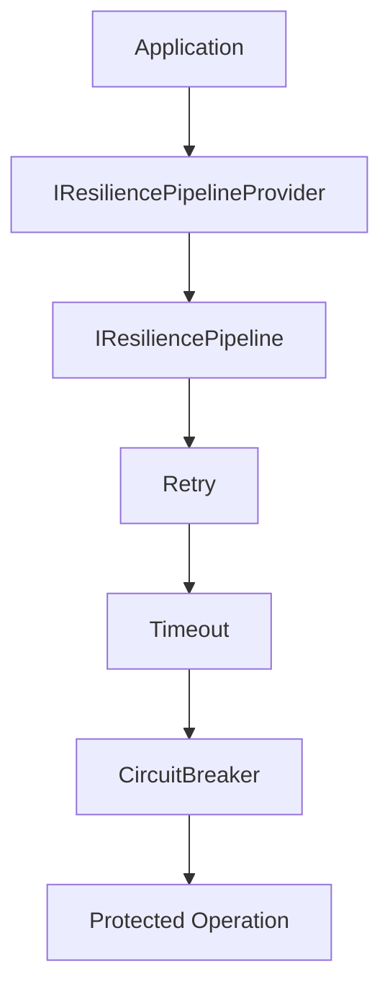

# ⚡ CoreSystem.Resilience

> **Production-ready resilience framework for .NET 8**

CoreSystem.Resilience is a lightweight and extensible resilience framework built for modern .NET applications. It provides a clean abstraction over resilience strategies while keeping application code independent from the underlying implementation.

Designed around **named resilience pipelines**, the framework allows different infrastructure components—such as Redis, HTTP clients, databases, or messaging systems—to define their own resilience policies without coupling business logic to a specific resilience library.


---

## Why CoreSystem.Resilience?

Modern applications communicate with many external dependencies, each with different reliability characteristics.

CoreSystem.Resilience helps you build robust applications by providing:

* ✅ Named resilience pipelines
* ✅ Retry, Timeout and Circuit Breaker strategies
* ✅ Provider-independent API
* ✅ Dependency Injection integration
* ✅ Strongly typed configuration
* ✅ OpenTelemetry metrics
* ✅ Extensible architecture for custom strategies

---

# Features

* Named resilience pipelines
* Retry strategy
* Timeout strategy
* Circuit Breaker strategy
* Fluent configuration API
* appsettings.json support
* Strongly typed options
* OpenTelemetry integration
* Built-in metrics
* Extensible pipeline architecture
* Clean abstraction over Polly

---

# Installation

Install the NuGet package.

```bash
dotnet add package CoreSystem.Resilience
```

---

# Quick Start

Register the framework.

```csharp
builder.Services.AddResilience(options =>
{
    options.AddPipeline(PipelineType.Redis, pipeline =>
    {
        pipeline.AddRetry(retry =>
        {
            retry.MaxRetryAttempts = 3;
        });

        pipeline.AddTimeout(timeout =>
        {
            timeout.Timeout = TimeSpan.FromSeconds(2);
        });

        pipeline.AddCircuitBreaker(circuit =>
        {
            circuit.FailureRatio = 0.5;
        });
    });
});
```

Resolve a pipeline.

```csharp
public sealed class RedisService(
    IResiliencePipelineProvider provider)
{
    private readonly IResiliencePipeline _pipeline =
        provider.GetPipeline(PipelineType.Redis);
}
```

Execute a protected operation.

```csharp
await _pipeline.ExecuteAsync(async cancellationToken =>
{
    await redisDatabase.StringGetAsync("products:1");
});
```

---

# Architecture Overview

CoreSystem.Resilience is built around **named resilience pipelines**.

Applications depend only on the framework abstractions while the framework composes one or more resilience strategies internally before executing the protected operation.



---

# Built-in Strategies

CoreSystem.Resilience currently provides three production-ready resilience strategies.

| Strategy        | Purpose                                   |
| --------------- | ----------------------------------------- |
| Retry           | Automatically retries transient failures. |
| Timeout         | Limits operation execution time.          |
| Circuit Breaker | Protects unhealthy dependencies.          |

Strategies can be combined inside a pipeline and execute in registration order.

---

# Configuration

Pipelines can be configured using the fluent API or the .NET Options pattern.

Supported configuration methods include:

* Fluent configuration
* appsettings.json
* Strongly typed options
* Multiple named pipelines
* Exception filtering

---

# Observability

CoreSystem.Resilience publishes operational metrics through **System.Diagnostics.Metrics** and integrates naturally with OpenTelemetry.

Built-in metrics include:

* Pipeline executions
* Execution duration
* Retry attempts
* Retry successes
* Retry failures
* Timeout events
* Circuit Breaker transitions

Compatible monitoring platforms include:

* Prometheus
* Grafana
* Azure Monitor
* Datadog
* Any OTLP-compatible backend

---

# Extensibility

The framework has been designed around composition rather than modification.

Extension points include:

* Custom pipeline builders
* Custom resilience strategies
* Custom metrics
* Additional pipeline types
* Dependency Injection replacement

Future strategies such as **Bulkhead**, **Fallback**, **Rate Limiter**, and **Hedging** can be introduced without breaking the public API.

---

# Documentation

Detailed documentation is available in the `docs/Resilience` folder.

| Guide                 | Description                     |
| --------------------- | ------------------------------- |
| 01-getting-started.md | Installation and first pipeline |
| 02-architecture.md    | Architecture and design         |
| 03-core-components.md | Framework components            |
| 04-pipelines.md       | Pipeline lifecycle              |
| 05-configuration.md   | Configuration guide             |
| 06-retry.md           | Retry strategy                  |
| 07-timeout.md         | Timeout strategy                |
| 08-circuit-breaker.md | Circuit Breaker strategy        |
| 09-observability.md   | Metrics and OpenTelemetry       |
| 10-extensibility.md   | Extension points                |
| roadmap.md            | Planned features                |

---

# Roadmap

## Available

* Named pipelines
* Retry
* Timeout
* Circuit Breaker
* OpenTelemetry metrics
* Dependency Injection integration

## Planned

* Bulkhead
* Hedging
* Rate Limiter
* Fallback
* Distributed tracing
* Dynamic configuration

---

# Contributing

Contributions are welcome.

Whether you're fixing bugs, improving documentation, proposing new resilience strategies, or enhancing the developer experience, your feedback helps make CoreSystem.Resilience better for everyone.

Feel free to:

* Open an Issue
* Start a Discussion
* Submit a Pull Request

---

# License

Licensed under the MIT License.
